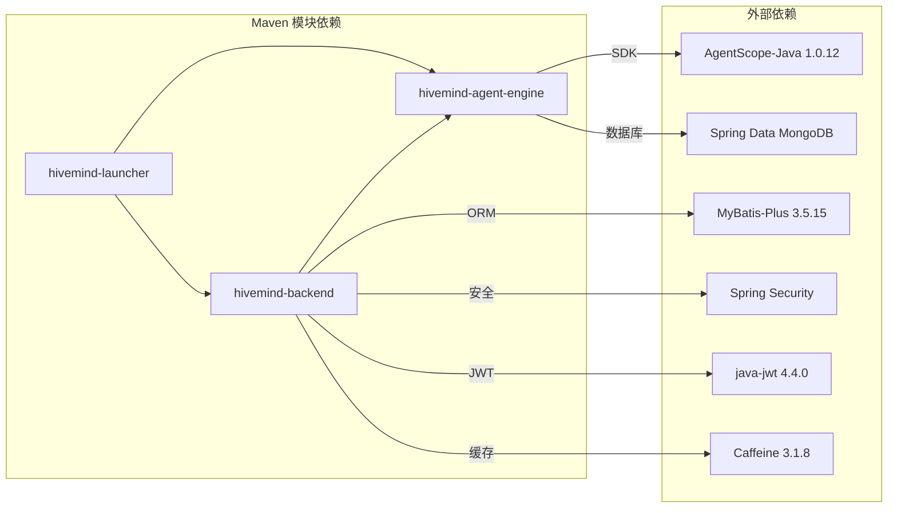
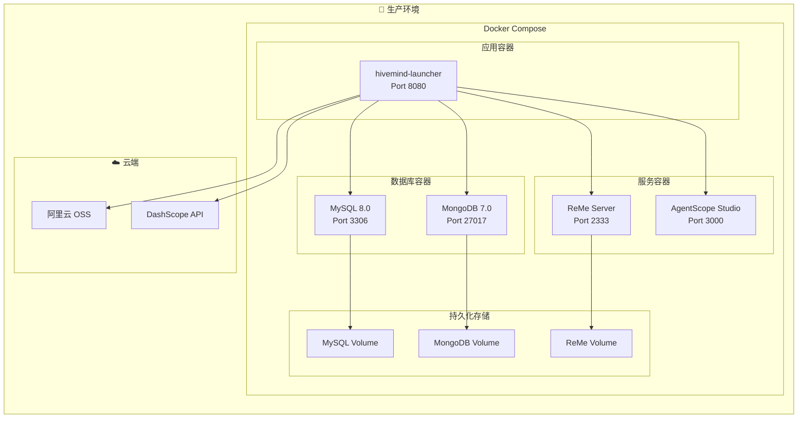

# HiveMind 系统架构设计

> 本文档详细描述了 HiveMind 云原生 AI 助手平台的完整系统架构，包括模块划分、组件关系、数据流向及技术选型。

---

## 1. 系统架构总览

HiveMind 采用 **DDD 分层架构** + **微服务化模块设计**，以 Spring Boot 4.0.3 为基座，集成了 AgentScope Java SDK 构建多 Agent 协作系统。

### 1.1 架构设计原则

| 原则 | 说明 |
|------|------|
| **分层隔离** | Adapter → Application → Domain ← Infrastructure |
| **模块解耦** | Backend / AgentEngine / Launcher 三模块独立部署 |
| **双数据库策略** | MySQL 存业务数据，MongoDB 存 Agent 运行时数据 |
| **安全防护** | ToolGuard 三层安全引擎（Deny → Guard → Allow） |
| **可观测性** | AgentScope Studio 提供实时监控与追踪 |

---

## 2. Mermaid 架构图

```mermaid
graph TB
    %% ==================== 用户层 ====================
    subgraph USER_LAYER["👤 用户层"]
        Browser["🌐 用户浏览器<br/>API 客户端"]
    end

    %% ==================== 前端控制台 ====================
    subgraph FRONTEND["🖥️ 前端控制台 · React 19 · Ant Design 6"]
        direction LR
        AuthPages["🔐 登录/注册<br/>LoginPage<br/>RegisterPage"]
        Console["💬 Agent 控制台<br/>ChatPage<br/>ConversationWorkspace"]
        TaskCenter["📋 任务中心<br/>TaskTemplateLibrary<br/>ScheduledTasks"]
        SystemAdmin["⚙️ 系统管理<br/>ModelConfig<br/>ToolLibrary<br/>SkillLibrary"]
    end

    %% ==================== 后端服务层 ====================
    subgraph SPRING_BOOT["🍃 Spring Boot 4.0.3 · Port 8080"]
        
        %% ---- hivemind-backend ----
        subgraph BACKEND["📦 hivemind-backend · 业务后端服务"]
            direction LR
            
            subgraph AUTH["🔐 Auth 认证"]
                JWT["JWT 生成/验证<br/>java-jwt 4.4.0"]
                JwtFilter["JwtAuthenticationFilter"]
                UserDetails["UserDetailsServiceImpl"]
            end
            
            subgraph USER["👤 User 用户管理"]
                UserController["SysUserController"]
                UserService["ISysUserService"]
            end
            
            subgraph TASK["📋 Task 任务管理"]
                TaskController["AgentTaskController"]
                TaskService["IAgentTaskService"]
                TaskReport["ITaskReportService"]
            end
            
            subgraph MODEL["🤖 Model LLM 配置"]
                ModelController["SysModelsController"]
                ModelService["ISysModelsService"]
                ProviderService["IProviderService"]
            end
            
            subgraph MCP_CONFIG["🔗 MCP 工具配置"]
                McpController["SysMcpController"]
                McpService["ISysMcpService"]
            end
            
            subgraph CRON["⏰ Cron 定时任务"]
                JobController["ScheduledJobController"]
                JobService["IScheduledJobService"]
            end
            
            subgraph TOKEN["💰 Token 费用统计"]
                TokenController["SysTokenUsageController"]
                TokenService["ISysTokenUsageService"]
            end
            
            subgraph REPORT["📊 Report 任务报告"]
                ReportController["TaskReportController"]
                ReportService["ITaskReportService"]
            end
            
            subgraph BACKEND_SUPPORT["🛠️ 支撑组件"]
                MyBatisPlus["MyBatis-Plus 3.5.15<br/>ORM 映射"]
                Caffeine["Caffeine 3.1.8<br/>本地缓存"]
                SecurityUtils["SecurityUtils<br/>用户上下文"]
            end
        end
        
        %% ---- hivemind-agent-engine ----
        subgraph AGENT_ENGINE["🧠 hivemind-agent-engine · AI Agent 引擎核心"]
            direction LR
            
            subgraph AGENT_CORE["🤖 Agent 核心"]
                ReActAgent["ReActAgent<br/>最大 200 轮迭代"]
                ModelFactory["TdAgentModelFactory<br/>模型工厂"]
                PromptService["TdAgentPromptService<br/>提示词管理"]
            end
            
            subgraph TOOL_GUARD["🛡️ ToolGuard 三层安全"]
                GuardEngine["ToolGuardEngine<br/>风险评估引擎"]
                GuardedTool["GuardedAgentTool<br/>工具代理"]
                ApprovalService["ToolApprovalService<br/>人工审批"]
            end
            
            subgraph TOOLS["🔧 工具系统"]
                ToolKit["SystemToolRegistry<br/>内置工具注册"]
                BuiltinTools["TdAgentBuiltinTools<br/>会话记忆搜索"]
                TimeTool["SystemTimeTool<br/>时间工具"]
            end
            
            subgraph SKILL["🎯 Skill 技能系统"]
                SkillInfo["TdAgentSkillInfo<br/>技能元数据"]
                SkillController["TdAgentSkillController<br/>技能管理"]
            end
            
            subgraph MEMORY["🧠 记忆系统"]
                MemoryManager["TdAgentMemoryManager<br/>记忆管理器"]
                MongoMemory["MongoConversationMemory<br/>短时记忆存储"]
                Compaction["ContextCompressor<br/>上下文压缩"]
                TokenMeter["EstimatingTokenMeter<br/>Token 计量"]
            end
            
            subgraph REME["📚 ReMe 长期记忆"]
                ReMeService["TdAgentReMeService<br/>长期记忆服务"]
                RemMCP["ReMe MCP Client<br/>MCP 协议集成"]
            end
            
            subgraph STREAMING["📡 流式输出"]
                StreamEvent["TdAgentStreamEvent<br/>SSE 事件"]
                SessionRegistry["TdAgentActiveSessionRegistry<br/>会话注册"]
            end
            
            subgraph AGENT_SUPPORT["🛠️ 支撑组件"]
                Observability["ObservabilityService<br/>可观测性"]
                SessionState["AgentSessionStateService<br/>会话状态"]
            end
        end
        
        subgraph LAUNCHER["🚀 hivemind-launcher · 启动器"]
            MainApp["HiveMindApplication<br/>Spring Boot Entry"]
            ProfileLoader["Profile Loader<br/>backend + agentic"]
        end
    end

    %% ==================== Agent Runtime ====================
    subgraph AGENT_RUNTIME["⚙️ AgentScope 运行时"]
        direction LR
        
        subgraph SANDBOX["📦 Tool Sandbox 工具沙箱"]
            ShellSandbox["Shell Sandbox<br/>命令行执行"]
            PythonSandbox["Python Sandbox<br/>脚本执行"]
            BrowserSandbox["Browser Sandbox<br/>浏览器自动化"]
        end
        
        subgraph STUDIO["📊 AgentScope Studio"]
            Tracing["Tracing<br/>调用链追踪"]
            ChatUI["Chat UI<br/>调试界面"]
            Evaluation["Evaluation<br/>效果评估"]
        end
    end

    %% ==================== 基础设施层 ====================
    subgraph INFRASTRUCTURE["🏗️ 基础设施层"]
        direction LR
        
        subgraph MYSQL["🐬 MySQL 8.0"]
            direction LR
            MySQL_Tables1["sys_user<br/>sys_models<br/>sys_mcp"]
            MySQL_Tables2["agent_task<br/>task_report<br/>task_flow_log"]
            MySQL_Tables3["scheduled_job<br/>scheduled_job_run_record<br/>token_usage"]
        end
        
        subgraph MONGODB["🍃 MongoDB 7.0"]
            direction LR
            Mongo_Collections1["conversation_memory<br/>conversation_view"]
            Mongo_Collections2["agent_profile<br/>agent_session_state"]
            Mongo_Collections3["agent_skill<br/>tool_config<br/>tool_approval"]
        end
        
        subgraph OSS["☁️ 阿里云 OSS"]
            OSS_Bucket["对象存储<br/>Skill 资源<br/>用户文件"]
        end
        
        subgraph VOLUME["💾 本地文件系统"]
            RemVolume["ReMe Volume<br/>向量索引存储"]
        end
    end

    %% ==================== 外部服务 ====================
    subgraph EXTERNAL["🌍 外部服务"]
        direction LR
        
        subgraph LLM["🤖 LLM Providers"]
            direction TB
            DashScope["DashScope 阿里云<br/>Qwen 系列"]
            DeepSeek["DeepSeek<br/>DeepSeek-V3"]
            OpenAICompat["OpenAI Compatible<br/>通用接口"]
        end
        
        subgraph REME_SERVER["📚 ReMe Server"]
            RemFastAPI["Python FastAPI<br/>Port 2333"]
            RemMemory["长期记忆检索<br/>AgentScope-ReMe"]
        end
        
        subgraph STUDIO_EXT["📊 AgentScope Studio"]
            StudioUI["可视化 UI<br/>Port 3000"]
        end
    end

    %% ==================== 连接关系 ====================
    
    %% 用户到前端
    Browser -->|"HTTPS / SSE"| FRONTEND
    
    %% 前端到后端
    AuthPages -->|"REST API"| AUTH
    Console -->|"REST API / SSE"| AGENT_ENGINE
    TaskCenter -->|"REST API"| TASK
    SystemAdmin -->|"REST API"| MODEL
    SystemAdmin -->|"REST API"| MCP_CONFIG
    
    %% 后端模块间
    AUTH -->|"用户信息"| USER
    TASK -->|"任务状态"| REPORT
    TOKEN -->|"费用记录"| CRON
    
    %% Agent Engine 内部
    AGENT_CORE -->|"安全检查"| TOOL_GUARD
    TOOL_GUARD -->|"工具调用"| TOOLS
    AGENT_CORE -->|"记忆管理"| MEMORY
    MEMORY -->|"长期记忆"| REME
    AGENT_CORE -->|"流式输出"| STREAMING
    
    %% 到基础设施
    BACKEND -->|"ORM"| MYSQL
    AGENT_ENGINE -->|"文档存储"| MONGODB
    AGENT_ENGINE -->|"文件存储"| OSS
    REME -->|"向量索引"| VOLUME
    
    %% 到外部服务
    AGENT_ENGINE -->|"LLM 调用"| LLM
    REME -->|"MCP 协议"| REME_SERVER
    AGENT_ENGINE -->|"追踪上报"| STUDIO_EXT
    
    %% Agent Runtime
    TOOLS -->|"沙箱执行"| SANDBOX
    AGENT_ENGINE -->|"状态上报"| STUDIO

    %% ==================== 样式 ====================
    classDef userStyle fill:#E8EAF6,stroke:#3F51B5,stroke-width:2px
    classDef frontendStyle fill:#E3F2FD,stroke:#1976D2,stroke-width:2px
    classDef backendStyle fill:#E8F5E9,stroke:#388E3C,stroke-width:2px
    classDef agentStyle fill:#FFF3E0,stroke:#F57C00,stroke-width:2px
    classDef runtimeStyle fill:#FCE4EC,stroke:#C2185B,stroke-width:2px
    classDef infraStyle fill:#F3E5F5,stroke:#7B1FA2,stroke-width:2px
    classDef externalStyle fill:#E0F7FA,stroke:#00838F,stroke-width:2px
    
    class Browser userStyle
    class AuthPages,Console,TaskCenter,SystemAdmin frontendStyle
    class AUTH,USER,TASK,MODEL,MCP_CONFIG,CRON,TOKEN,REPORT,BACKEND_SUPPORT backendStyle
    class AGENT_CORE,TOOL_GUARD,TOOLS,SKILL,MEMORY,REME,STREAMING,AGENT_SUPPORT agentStyle
    class ShellSandbox,PythonSandbox,BrowserSandbox,Tracing,ChatUI,Evaluation runtimeStyle
    class MYSQL,MONGODB,OSS,VOLUME infraStyle
    class LLM,REME_SERVER,STUDIO_EXT externalStyle
```



---

## 3. ASCII 架构图

```
╔══════════════════════════════════════════════════════════════════════════════════════════════════════╗
║                                    👤 用户浏览器 / API 客户端                                      ║
╚══════════════════════════════════════════════════════════════════════════════════════════════════════╝
                                              │
                                              │ HTTPS / SSE
                                              ▼
┌─────────────────────────────────────────────────────────────────────────────────────────────────────┐
│                          🖥️ 前端控制台 · React 19 · Ant Design 6 · Vite 5                           │
│  ┌──────────────┐  ┌──────────────┐  ┌──────────────┐  ┌──────────────┐  ┌──────────────┐          │
│  │  🔐 登录注册  │  │ 💬 Agent控制台 │  │ 📋 任务中心   │  │ ⚙️ 系统管理   │  │ 👤 个人资料   │          │
│  │  LoginPage   │  │  ChatPage    │  │ TaskTemplate │  │ ModelConfig  │  │ ProfilePage  │          │
│  │  RegisterPage│  │  Chat        │  │ ScheduledJob │  │ ToolLibrary  │  │              │          │
│  │              │  │  Workspace   │  │              │  │ SkillLibrary │  │              │          │
│  └──────────────┘  └──────────────┘  └──────────────┘  └──────────────┘  └──────────────┘          │
└─────────────────────────────────────────────────────────────────────────────────────────────────────┘
                                              │
                                              │ REST API / SSE
                                              ▼
╔══════════════════════════════════════════════════════════════════════════════════════════════════════╗
║                         🍃 Spring Boot 4.0.3 · Port 8080 · Java 17                                ║
║                                                                                                    ║
║  ┌─────────────────────────────────────────────────────────────────────────────────────────────┐    ║
║  │                        📦 hivemind-backend · 业务后端服务                                    │    ║
║  │                                                                                             │    ║
║  │  ┌────────────┐ ┌────────────┐ ┌────────────┐ ┌────────────┐ ┌────────────┐                 │    ║
║  │  │ 🔐 Auth    │ │ 👤 User    │ │ 📋 Task    │ │ 🤖 Model   │ │ 🔗 MCP     │                 │    ║
║  │  │ JWT 认证   │ │ 用户管理   │ │ 任务管理   │ │ LLM配置    │ │ 工具配置   │                 │    ║
║  │  │ Filter     │ │ CRUD       │ │ Report     │ │ Provider   │ │ 安全策略   │                 │    ║
║  │  └────────────┘ └────────────┘ └────────────┘ └────────────┘ └────────────┘                 │    ║
║  │  ┌────────────┐ ┌────────────┐ ┌────────────┐ ┌────────────────────────────┐                 │    ║
║  │  │ ⏰ Cron    │ │ 💰 Token   │ │ 📊 Report  │ │ 🛠️ 支撑组件                 │                 │    ║
║  │  │ 定时任务   │ │ 费用统计   │ │ 任务报告   │ │ MyBatis-Plus 3.5.15 ORM    │                 │    ║
║  │  │ Scheduler  │ │ Usage      │ │ Analytics  │ │ Caffeine 3.1.8 Cache       │                 │    ║
║  │  └────────────┘ └────────────┘ └────────────┘ └────────────────────────────┘                 │    ║
║  └─────────────────────────────────────────────────────────────────────────────────────────────┘    ║
║                                              │                                                     ║
║                                              ▼                                                     ║
║  ┌─────────────────────────────────────────────────────────────────────────────────────────────┐    ║
║  │                        🧠 hivemind-agent-engine · AI Agent 引擎核心                          │    ║
║  │                                                                                             │    ║
║  │  ┌────────────────────────────────────────────────────────────────────────────────────┐      │    ║
║  │  │                           🤖 Agent 核心运行时                                       │      │    ║
║  │  │  ┌──────────────┐  ┌──────────────┐  ┌──────────────┐  ┌──────────────┐            │      │    ║
║  │  │  │ ReActAgent   │  │ ModelFactory │  │ PromptService│  │ SessionCtx   │            │      │    ║
║  │  │  │ 最大200轮迭代│  │ 模型工厂     │  │ 提示词管理   │  │ 会话上下文   │            │      │    ║
║  │  │  └──────────────┘  └──────────────┘  └──────────────┘  └──────────────┘            │      │    ║
║  │  └────────────────────────────────────────────────────────────────────────────────────┘      │    ║
║  │                                                                                             │    ║
║  │  ┌──────────────────────┐  ┌──────────────────────┐  ┌──────────────────────┐               │    ║
║  │  │  🛡️ ToolGuard        │  │  🔧 工具系统          │  │  🎯 Skill 技能系统   │               │    ║
║  │  │  ─────────────────── │  │  ─────────────────── │  │  ─────────────────── │               │    ║
║  │  │  • ToolGuardEngine   │  │  • SystemToolRegistry│  │  • TdAgentSkillInfo  │               │    ║
║  │  │    三层安全引擎      │  │    内置工具注册       │  │    技能元数据        │               │    ║
║  │  │  • GuardedAgentTool  │  │  • TdAgentBuiltinTools│ │  • SkillController   │               │    ║
║  │  │    工具调用代理      │  │    会话记忆搜索       │  │    技能管理API       │               │    ║
║  │  │  • ApprovalService   │  │  • SystemTimeTool    │  │  • SkillStorage      │               │    ║
║  │  │    人工审批流程      │  │    系统时间工具       │  │    OSS/Mongo存储     │               │    ║
║  │  └──────────────────────┘  └──────────────────────┘  └──────────────────────┘               │    ║
║  │                                                                                             │    ║
║  │  ┌──────────────────────────────────────────────────────────────────────────────────────┐    │    ║
║  │  │                              🧠 记忆系统                                              │    │    ║
║  │  │  ┌─────────────────────┐  ┌─────────────────────┐  ┌─────────────────────┐           │    │    ║
║  │  │  │  📝 短时记忆         │  │  📚 长时记忆         │  │  🗜️ 上下文压缩      │           │    │    ║
║  │  │  │  MongoConversation  │  │  TdAgentReMeService │  │  ContextCompressor  │           │    │    ║
║  │  │  │  Memory             │  │  ReMe MCP Client    │  │  TokenMeter         │           │    │    ║
║  │  │  │  MongoDB存储        │  │  向量检索            │  │  Window Manager     │           │    │    ║
║  │  │  └─────────────────────┘  └─────────────────────┘  └─────────────────────┘           │    │    ║
║  │  └──────────────────────────────────────────────────────────────────────────────────────┘    │    ║
║  │                                                                                             │    ║
║  │  ┌──────────────────────┐  ┌──────────────────────┐  ┌──────────────────────┐               │    ║
║  │  │  📡 流式输出          │  │  🔌 MCP 协议          │  │  🛠️ 支撑组件         │               │    ║
║  │  │  • StreamEvent       │  │  • MCP Client        │  │  • Observability     │               │    ║
║  │  │    SSE事件推送       │  │    工具协议集成       │  │    可观测性服务      │               │    ║
║  │  │  • SessionRegistry   │  │  • ToolConfig        │  │  • SessionState      │               │    ║
║  │  │    活跃会话管理      │  │    动态工具配置       │  │    会话状态持久化    │               │    ║
║  │  └──────────────────────┘  └──────────────────────┘  └──────────────────────┘               │    ║
║  └─────────────────────────────────────────────────────────────────────────────────────────────┘    ║
║                                              │                                                     ║
║  ┌─────────────────────────────────────────────────────────────────────────────────────────────┐    ║
║  │  🚀 hivemind-launcher · Spring Boot Entry Point · Profile Loader (backend + agentic)       │    ║
║  └─────────────────────────────────────────────────────────────────────────────────────────────┘    ║
╚══════════════════════════════════════════════════════════════════════════════════════════════════════╝
                           │                                        │
           ┌───────────────┼────────────────────────────────────────┼───────────────┐
           │               │                                        │               │
           ▼               ▼                                        ▼               ▼
┌─────────────────────────────────┐  ┌─────────────────────────────────────────────────────────────┐
│     ⚙️ AgentScope 运行时         │  │                    🏗️ 基础设施层                            │
│  ┌───────────────────────────┐  │  │                                                             │
│  │  📦 Tool Sandbox          │  │  │  ┌─────────────┐  ┌─────────────┐  ┌─────────────┐        │
│  │  ─────────────────────── │  │  │  │ 🐬 MySQL 8.0 │  │ 🍃 MongoDB  │  │ ☁️ 阿里云OSS │        │
│  │  • Shell Sandbox          │  │  │  │             │  │    7.0      │  │             │        │
│  │    命令行执行              │  │  │  │ sys_user    │  │             │  │ Skill资源   │        │
│  │  • Python Sandbox         │  │  │  │ sys_models  │  │ conversation│  │ 用户文件    │        │
│  │    脚本执行                │  │  │  │ sys_mcp     │  │ _memory     │  │             │        │
│  │  • Browser Sandbox        │  │  │  │ agent_task  │  │ agent_      │  │             │        │
│  │    浏览器自动化            │  │  │  │ task_report │  │ profile     │  │             │        │
│  └───────────────────────────┘  │  │  │ scheduled_  │  │ agent_skill │  └─────────────┘        │
│                                 │  │  │ job         │  │ tool_config │                          │
│  ┌───────────────────────────┐  │  │  │ token_usage │  │ tool_       │  ┌─────────────┐        │
│  │  📊 AgentScope Studio     │  │  │  │             │  │ approval    │  │ 💾 本地卷    │        │
│  │  ─────────────────────── │  │  │  └─────────────┘  └─────────────┘  │ ReMe Volume │        │
│  │  • Tracing 调用链追踪     │  │  │      业务数据         Agent运行时   │ 向量索引    │        │
│  │  • Chat UI 调试界面       │  │  │  ┌──────────────────────────────┐  └─────────────┘        │
│  │  • Evaluation 效果评估    │  │  │  │ 🛠️ ORM: MyBatis-Plus 3.5.15  │                          │
│  └───────────────────────────┘  │  │  │ 🛠️ Cache: Caffeine 3.1.8     │                          │
└─────────────────────────────────┘  │  └──────────────────────────────┘                          │
                                     └─────────────────────────────────────────────────────────────┘
                                                          │
                                                          ▼
┌─────────────────────────────────────────────────────────────────────────────────────────────────────┐
│                                    🌍 外部服务                                                      │
│  ┌─────────────────────────────────────┐  ┌─────────────────────────────────────────────────────┐  │
│  │  🤖 LLM Providers                   │  │  📚 ReMe Server (Python FastAPI)                    │  │
│  │  ─────────────────────────────────  │  │  ─────────────────────────────────────────────────  │  │
│  │  • DashScope (阿里云)                │  │  • Port: 2333                                       │  │
│  │    Qwen-Max / Qwen-Plus / Qwen-Turbo│  │  • AgentScope-ReMe 长期记忆检索                     │  │
│  │  • DeepSeek                          │  │  • MCP Protocol 集成                                │  │
│  │    DeepSeek-V3 / DeepSeek-R1         │  │  • 向量数据库存储                                    │  │
│  │  • OpenAI Compatible                 │  │                                                     │  │
│  │    通用 OpenAI 接口                   │  │  📊 AgentScope Studio                               │  │
│  └─────────────────────────────────────┘  │  • Port: 3000                                       │  │
│                                           │  • 可观测性 UI                                       │  │
│                                           │  • 调用链追踪                                        │  │
│                                           └─────────────────────────────────────────────────────┘  │
└─────────────────────────────────────────────────────────────────────────────────────────────────────┘
```

---

## 4. 模块依赖关系



---

## 5. 数据流架构

### 5.1 用户请求处理流程

```
┌──────────────┐     ┌──────────────┐     ┌──────────────┐     ┌──────────────┐
│   用户请求    │────▶│  JWT Filter  │────▶│  Controller  │────▶│   Service    │
└──────────────┘     └──────────────┘     └──────────────┘     └──────────────┘
                            │                     │                     │
                            ▼                     ▼                     ▼
                     ┌──────────────┐     ┌──────────────┐     ┌──────────────┐
                     │ Token 验证   │     │ 请求路由      │     │ 业务处理     │
                     │ 用户上下文    │     │ 参数校验      │     │ 数据访问     │
                     └──────────────┘     └──────────────┘     └──────────────┘
                                                                  │
                          ┌────────────────────────────────────────┘
                          ▼
                   ┌──────────────┐     ┌──────────────┐     ┌──────────────┐
                   │    MySQL     │     │   MongoDB    │     │    OSS       │
                   │  业务数据    │     │  Agent数据   │     │  文件存储    │
                   └──────────────┘     └──────────────┘     └──────────────┘
```

### 5.2 Agent 对话处理流程

```
┌──────────────┐     ┌──────────────┐     ┌──────────────┐     ┌──────────────┐
│   Chat API   │────▶│ ReAct Agent  │────▶│  ToolGuard   │────▶│  Tool Exec   │
└──────────────┘     └──────────────┘     └──────────────┘     └──────────────┘
                            │                     │                     │
                            ▼                     ▼                     ▼
                     ┌──────────────┐     ┌──────────────┐     ┌──────────────┐
                     │  LLM Provider│     │  风险评估     │     │  Sandbox     │
                     │  DashScope   │     │  Deny/Guard  │     │  Shell/Py    │
                     │  DeepSeek    │     │  Allow       │     │  Browser     │
                     └──────────────┘     └──────────────┘     └──────────────┘
                            │
                            ▼
                     ┌──────────────┐     ┌──────────────┐     ┌──────────────┐
                     │ Memory Mgr   │────▶│ Compaction   │────▶│ SSE Stream   │
                     └──────────────┘     └──────────────┘     └──────────────┘
                            │
              ┌─────────────┴─────────────┐
              ▼                           ▼
       ┌──────────────┐           ┌──────────────┐
       │  短时记忆     │           │  长时记忆     │
       │  MongoDB     │           │  ReMe Server │
       └──────────────┘           └──────────────┘
```

---

## 6. 技术栈详情

| 层级 | 技术 | 版本 | 用途 |
|------|------|------|------|
| **运行时** | Java | 17 | 后端运行环境 |
| **框架** | Spring Boot | 4.0.3 | 应用框架 |
| **AI SDK** | AgentScope-Java | 1.0.12 | Agent 运行时 |
| **ORM** | MyBatis-Plus | 3.5.15 | MySQL 数据访问 |
| **文档库** | Spring Data MongoDB | - | MongoDB 数据访问 |
| **安全** | Spring Security | - | 认证授权 |
| **JWT** | java-jwt | 4.4.0 | Token 生成验证 |
| **缓存** | Caffeine | 3.1.8 | 本地缓存 |
| **前端** | React | 19 | UI 框架 |
| **UI库** | Ant Design | 6 | 组件库 |
| **构建** | Vite | 5 | 前端构建 |
| **数据库** | MySQL | 8.0 | 业务数据 |
| **文档库** | MongoDB | 7.0+ | Agent 运行时数据 |
| **存储** | 阿里云 OSS | 3.17.4 | 对象存储 |
| **LLM** | DashScope/Qwen | - | 阿里云大模型 |
| **LLM** | DeepSeek | - | 深度求索大模型 |

---

## 7. 安全架构

### 7.1 ToolGuard 三层安全引擎

```
┌─────────────────────────────────────────────────────────────────────┐
│                        🛡️ ToolGuard 三层安全                        │
├─────────────────────────────────────────────────────────────────────┤
│                                                                     │
│  Layer 1: Deny Layer (拒绝层)                                        │
│  ┌───────────────────────────────────────────────────────────────┐  │
│  │ • 工具启用检查：用户禁用的工具直接拒绝                          │  │
│  │ • 危险命令检测：匹配拒绝模式（rm -rf, DROP TABLE等）           │  │
│  │ • 敏感路径检测：.env, .git, id_rsa 等敏感文件                  │  │
│  └───────────────────────────────────────────────────────────────┘  │
│                              │                                      │
│                              ▼                                      │
│  Layer 2: Guard Layer (防护层)                                       │
│  ┌───────────────────────────────────────────────────────────────┐  │
│  │ • 高风险工具识别：根据 ToolRiskLevel 评估                      │  │
│  │ • 人工审批流程：需要用户确认的工具调用                          │  │
│  │ • 审批记录存储：MongoDB tool_approval 集合                     │  │
│  └───────────────────────────────────────────────────────────────┘  │
│                              │                                      │
│                              ▼                                      │
│  Layer 3: Allow Layer (放行层)                                       │
│  ┌───────────────────────────────────────────────────────────────┐  │
│  │ • 默认放行：未命中任何风险规则的普通工具调用                    │  │
│  │ • 低风险标记：ToolRiskLevel.LOW                                │  │
│  │ • 执行并记录：记录工具调用日志                                  │  │
│  └───────────────────────────────────────────────────────────────┘  │
│                                                                     │
└─────────────────────────────────────────────────────────────────────┘
```

### 7.2 JWT 认证流程

```
┌──────────────┐     ┌──────────────┐     ┌──────────────┐     ┌──────────────┐
│   登录请求    │────▶│ 验证用户凭证  │────▶│ 生成 JWT     │────▶│ 返回 Token   │
└──────────────┘     └──────────────┘     └──────────────┘     └──────────────┘
                                                                  │
                                                                  ▼
┌──────────────┐     ┌──────────────┐     ┌──────────────┐     ┌──────────────┐
│   API 请求    │────▶│ JWT Filter   │────▶│ Token 验证   │────▶│ 用户上下文    │
└──────────────┘     └──────────────┘     └──────────────┘     └──────────────┘
                                              │
                                              ▼
                                       ┌──────────────┐
                                       │ 过期/无效     │
                                       │ 返回 401     │
                                       └──────────────┘
```

---

## 8. 部署架构



---

## 9. 核心配置文件

| 文件 | 用途 | 关键配置 |
|------|------|----------|
| `application.yaml` | 主配置 | Port 8080, profiles: backend, agentic |
| `application-backend.yaml` | 后端配置 | MySQL, JWT, Swagger |
| `application-agentic.yaml` | Agent配置 | Model, ToolGuard, ReMe, Sandbox |
| `builtin_provider.json` | LLM供应商 | DashScope, DeepSeek 定义 |

---

## 10. 监控与可观测性

| 组件 | 功能 | 端口 |
|------|------|------|
| AgentScope Studio | Agent 调用链追踪、效果评估 | 3000 |
| ObservabilityService | 内部可观测性上报 | - |
| TokenUsage | LLM 费用统计与分析 | - |
| TaskFlowLog | 任务执行日志记录 | - |

---

> 📅 文档生成时间：2026-07-14  
> 📝 版本：v1.0  
> 👤 作者：HiveMind Architecture Team
