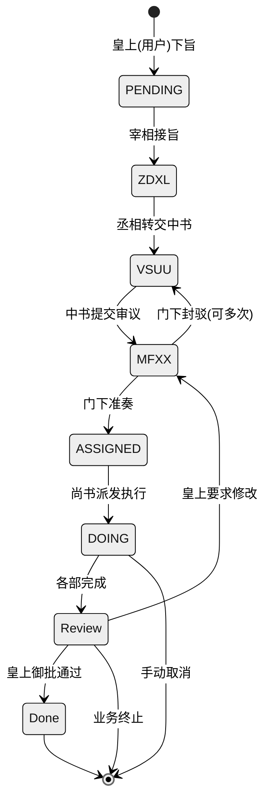

## 一、定位与目标

本项目是一个全新的基于多 Agent 协作架构的个人助理平台，以中国古代沿用千年的【三省六部】制度为蓝本，基于 Spring Boot、Spring
AI、Spring AI Alibaba 等后端技术框架，对各类 AI Agent 进行组织与工作分配，实现一套制度化、流程化、职责分明的 AI 多 Agent
协作框架。用户作为系统的最高决策者（“皇上”），通过与系统交互下达指令，系统将指令通过不同的“政府机构”（Agent
部门）进行分拣、规划、审议、执行和汇总，最终交付给用户高质量的结果。

## 二、领域建模

### 2.1 存储选型

+ 关系型数据库：MySQL 8.0.36（InnoDB，utf8mb4）
+ 文档型数据库：MongoDB
+ 缓存/分布式锁（可选）：Redis 7.2.x

### 2.2 业务建模

#### 业务实体

+ 实体：**皇上**
    - 职责：代表用户，向 Agent 系统发送消息（闲聊）或下达任务指令（下旨）
+ 实体：**宰相（ZDXL）**
    - 定位：消息分拣官，负责消息的接收、处理和分配
    - 职责：首先识别皇上的输入是任务旨意还是闲聊，闲聊则直接回复，任务（旨意）则整理任务实体转中书省处理；
    - 权限：只能调用 中书令
+ 实体：**中书令 (VSUU)**
    - 定位：任务规划官，负责针对任务方案的起草；
    - 职责：接旨后分析需求，拆解为子任务（todos），交由 门下省 审议；
    - 权限：只能调用 门下省
+ 实体：**门下省 /侍中(MFXX)**
    - 定位：方案审议官、负责把握方案质量；
    - 职责：审查中书方案（可行性、完整性、风险），若审议通过，转 尚书省 开始执行，否则<font style="color:rgb(51, 51, 51);">
      封驳重修</font>，转 中书省 重新修改，驳回时包含具体的修改建议，修改后重新审议，<font style="color:rgb(51, 51, 51);">
      封驳</font>过程限制最多执行 3 轮
    - 权限：只能调用 尚书令 + 回调 中书令
+ 实体：**尚书令 (UHUU)**
    - 定位：任务派发官、执行总指挥；
    - 职责：接收门下省提交的执行方案，依次执行，汇总执行结果，回调 中书令，由 中书令 整理为奏章，呈报皇上审阅；
    - 权限：只能调用 中书令，不能越权调用其他实体；

#### 业务流转图

mermaid 代码：



<!-- 这是一张图片，ocr 内容为： -->


### 2.3 MySQL 存储表设计

#### 场景表总览

> 表字段见表：[TangDynastyTable](https://www.yuque.com/liangshoux/hzp1qk/bbhh53eqgtg0x18w)，或后文的 MySQL DDL
>

| 场景   | 业务场景  | 业务功能描述                                                                        | 存储表                          | 表职能                                                                           |
|------|-------|-------------------------------------------------------------------------------|------------------------------|-------------------------------------------------------------------------------|
| 用户登录 | Login | 用户登录                                                                          | sys_users                    | 存储用户信息、登录时鉴权等                                                                 |
| 早朝   | 上朝    | 发起 AI 对话                                                                      | conversations_view（MongoDB）  | <font style="color:#080808;background-color:#ffffff;">Agent对话session视图</font> |
|      |       |                                                                               | conversations_memory（Mongo）  | <font style="color:#080808;background-color:#ffffff;">Agent历史对话记忆</font>      |
|      | 旨意库   | 从预设指令模板快速下达任务                                                                 | sys_edict_template           | 预设的旨意模板（分类/参数 schema/预估 token/费用）                                             |
| 御书房  | 翰林学士  | 消息通道 channel                                                                  | sys_channels                 | 渠道配置，密钥必须加密存储                                                                 |
|      | 旨意看板  | 任务总览、执行情况、流转进度、执行详情等                                                          | edict_tasks                  | 任务/旨意实例（主表）                                                                   |
|      |       |                                                                               | edict_task_flow_log          | 流转与进度日志（flow/progress/review）                                                 |
|      |       |                                                                               | edict_task_scheduler         | 调度元数据（分布式调度/重试/升级）                                                            |
|      |       |                                                                               | ~~sys_memorial~~             | ~~奏折（任务产出归档）~~                                                                |
|      | 奏折    |                                                                               | edict_memorial               | 奏折正文/引用附件/状态（draft/submitted/approved）                                        |
|      |       |                                                                               | ~~sys_channel_delivery_log~~ | ~~投递日志（用于排障与审计）~~                                                             |
|      | 司天台   | 创建和管理 AI 助手按时间自动执行的定时任务。                                                      | scheduled_job                | 定时任务定义（Cron/一次性/事件触发）                                                         |
|      |       |                                                                               | scheduled_job_run_record     | 运行记录（开始/结束/错误/耗时/重试）                                                          |
| 御史台  | 朝纲    | 编辑定义 AI 助手人设和行为的文件——SOUL.md、AGENTS.md、 HEARTBEAT.md 等——全部在浏览器中完成。             | sys_config                   |                                                                               |
|      | 技能库   | 管理扩展 AI 助手能力的技能（如读取 PDF、创建 Word 文档、获取新闻等）。                                    | sys_skills                   | 扫描项目工程中的技能初始化，新安装的技能再单独做处理                                                    |
|      | 工具库   | 管理 AI 助手使用的系统工具（如 执行命令行、进行浏览器Web搜索等 等）。                                       | sys_tools                    | 扫描项目工程中提供的工具进行初始化                                                             |
|      | MCP   | 启用/禁用/删除MCP，或者创建新的客户端。                                                        | sys_mcp                      |                                                                               |
|      | 官员管理  | 配置三省六部各个部门官员的权限、模型、系统提示词Soul、输出限制等，同时支持为各部录用新的官员，初始的三省六部官员为系统默认官员，为各部门对应的最高职权 | sys_officials                | 官员（Agent 实例配置）                                                                |
|      |       |                                                                               | sys_official_policy          | 权限/限额/安全策略（工具白名单、审批阈值等）                                                       |
|      |       |                                                                               | sys_official_prompt          | 提示词文件引用/版本（可与 workspace_file 关联）                                              |
| 九司   | 模型    | 配置 LLM 提供商并选择 AI 助手使用的模型。AI 助手同时支持云提供商（需要 API Key）                            | sys_models                   |                                                                               |
|      | 环境变量  | 管理 AI 助手的工具和技能在运行时需要的环境变量（如 TAVILY_API_KEY）。                                  | sys_env_vars                 | 环境变量（Secret 必须加密/脱敏）                                                          |
|      | 卫尉寺   | 负责安全相关的配置，如 访问控制、工具权限管理 等。                                                    | sys_security_policy          | 全局安全策略（RBAC、工具审批、黑白名单）                                                        |
|      |       |                                                                               | sys_access_token             | 可选（如需要黑名单/撤销）                                                                 |
|      | 司农寺   | 查看一段时间内的 LLM Token 消耗，按日期和模型统计。                                               | sys_token_usage              | 按天/模型聚合                                                                       |
|      |       |                                                                               | sys_token_usage_view         | Token 消耗统计视图                                                                  |

#### MySQL DDL

> 项目工程启动时执行 SQL，完成建表
>

```sql
-- MySQL 8.0.36 / InnoDB / utf8mb4
CREATE DATABASE IF NOT EXISTS `tang_dynasty` DEFAULT CHARACTER SET utf8mb4 COLLATE utf8mb4_unicode_ci;
USE `tang_dynasty`;

-- ========== 用户与权限 ==========
CREATE TABLE IF NOT EXISTS `sys_user` (
  `id` BIGINT AUTO_INCREMENT COMMENT '主键',
  `user_id` VARCHAR(50) NOT NULL COMMENT '用户id',
  `phone_number` VARCHAR(20) NOT NULL COMMENT '用户电话号码，包含国际区号'
  `password` VARCHAR(255) NOT NULL COMMENT '密码哈希',
  `nickname` VARCHAR(100) COMMENT '昵称',
  `role` VARCHAR(50) DEFAULT 'USER' COMMENT '角色',
   -- 微信登录核心字段
  `wechat_openid` VARCHAR(64) DEFAULT NULL COMMENT '微信应用唯一标识',
  `wechat_unionid` VARCHAR(64) DEFAULT NULL COMMENT '微信开放平台统一标识',
  -- 微信用户资料
  `wechat_nickname` VARCHAR(128) CHARACTER SET utf8mb4 COLLATE utf8mb4_unicode_ci DEFAULT NULL COMMENT '微信昵称',
  `wechat_avatar` VARCHAR(255) DEFAULT NULL COMMENT '微信头像URL',
  `gender` TINYINT DEFAULT 0 COMMENT '性别: 0-未知 1-男 2-女',
  
  `deleted` TINYINT(1) DEFAULT 0 COMMENT '逻辑删除',
  `version` INT DEFAULT 0 COMMENT '乐观锁版本',
  `create_time` DATETIME DEFAULT CURRENT_TIMESTAMP COMMENT '创建时间',
  `update_time` DATETIME DEFAULT CURRENT_TIMESTAMP ON UPDATE CURRENT_TIMESTAMP COMMENT '更新时间',
  PRIMARY KEY (`id`),
  UNIQUE KEY `uk_username` (`username`)
) ENGINE=InnoDB DEFAULT CHARSET=utf8mb4 COMMENT='系统用户表';

-- ================================ 御书房场景 ================================
-- 1. AI Agent通讯渠
CREATE TABLE IF NOT EXISTS `sys_channels` (
  `id` BIGINT UNSIGNED NOT NULL AUTO_INCREMENT COMMENT '主键ID',
  `user_id` BIGINT UNSIGNED NOT NULL COMMENT '登录的用户ID',
  `channel_name` VARCHAR(64) NOT NULL COMMENT '渠道名',
  `is_active` TINYINT(1) NOT NULL DEFAULT 0 COMMENT '是否启用: 0-否, 1-是',
  `bot_prefix` VARCHAR(32) DEFAULT '@bot' COMMENT '机器人前缀',
  `show_tool_message` TINYINT(1) NOT NULL DEFAULT 0 COMMENT '是否显示工具信息: 0-否, 1-是',
  `show_thinking` TINYINT(1) NOT NULL DEFAULT 0 COMMENT '是否显示思考过程: 0-否, 1-是',
  `documentation_address` VARCHAR(255) DEFAULT NULL COMMENT '说明文档地址',
  `specific_config` JSON DEFAULT NULL COMMENT '渠道对应的针对性配置',
  `create_time` DATETIME NOT NULL DEFAULT CURRENT_TIMESTAMP COMMENT '创建时间',
  `update_time` DATETIME NOT NULL DEFAULT CURRENT_TIMESTAMP ON UPDATE CURRENT_TIMESTAMP COMMENT '更新时间',
  PRIMARY KEY (`id`),
  KEY `idx_user_id` (`user_id`),
  KEY `idx_channel_name` (`channel_name`)
) ENGINE=InnoDB DEFAULT CHARSET=utf8mb4 COMMENT='AI Agent通讯渠道配置表';

-- 2. 任务/旨意表 (Tasks)
CREATE TABLE IF NOT EXISTS `edict_tasks` (
  `task_id` VARCHAR(64) NOT NULL COMMENT '任务ID, 如 JJC-20260228-E2E',
  `session_id` VARCHAR(64) DEFAULT NULL COMMENT '任务对应的session_id',
  `user_id` BIGINT UNSIGNED NOT NULL COMMENT '登录的用户ID',
  `title` VARCHAR(255) DEFAULT NULL COMMENT '任务标题',
  `official_id` BIGINT UNSIGNED DEFAULT NULL COMMENT '当前负责官员ID',
  `state` VARCHAR(32) NOT NULL DEFAULT 'PENDING' COMMENT '当前状态: PENDING/ZDXL/VSUU/MFXX/ASSIGNED/DOING/PREVIEW/DONE/FINISH',
  `priority` VARCHAR(16) DEFAULT 'normal' COMMENT '优先级: critical/high/normal/low',
  `block_reason` VARCHAR(512) DEFAULT NULL COMMENT '阻滞原因',
  `review_round` INT UNSIGNED NOT NULL DEFAULT 0 COMMENT '要求修改的轮数',
  `prev_state` VARCHAR(32) DEFAULT NULL COMMENT '被中断前的状态',
  `output_result` TEXT COMMENT '最终产出结果',
  `ac_criteria` TEXT COMMENT '验收标准',
  `archived` TINYINT(1) NOT NULL DEFAULT 0 COMMENT '是否归档: 0-否, 1-是',
  `archived_at` DATETIME DEFAULT NULL COMMENT '归档时间',
  `deleted` TINYINT(1) NOT NULL DEFAULT 0 COMMENT '逻辑删除: 0-未删除, 1-已删除',
  `create_time` DATETIME NOT NULL DEFAULT CURRENT_TIMESTAMP COMMENT '创建时间',
  `update_time` DATETIME NOT NULL DEFAULT CURRENT_TIMESTAMP ON UPDATE CURRENT_TIMESTAMP COMMENT '更新时间',
  PRIMARY KEY (`task_id`),
  KEY `idx_user_id` (`user_id`),
  KEY `idx_official_id` (`official_id`),
  KEY `idx_state` (`state`),
  KEY `idx_create_time` (`create_time`)
) ENGINE=InnoDB DEFAULT CHARSET=utf8mb4 COMMENT='任务/旨意实例主表';

-- 3. -- 任务流转记录表
CREATE TABLE IF NOT EXISTS `edict_task_flow_log` (
  `id` BIGINT UNSIGNED NOT NULL AUTO_INCREMENT COMMENT '主键ID',
  `user_id` BIGINT UNSIGNED NOT NULL COMMENT '登录的用户ID',
  `task_id` VARCHAR(64) NOT NULL COMMENT '任务ID',
  `source_node` VARCHAR(64) DEFAULT NULL COMMENT '来源节点',
  `source_output` TEXT COMMENT '来源节点的输出',
  `target_node` VARCHAR(64) DEFAULT NULL COMMENT '目标节点',
  `remark` VARCHAR(512) DEFAULT NULL COMMENT '流转备注',
  `create_time` DATETIME NOT NULL DEFAULT CURRENT_TIMESTAMP COMMENT '记录时间',
  PRIMARY KEY (`id`),
  KEY `idx_user_id` (`user_id`),
  KEY `idx_task_id` (`task_id`),
  KEY `idx_create_time` (`create_time`)
) ENGINE=InnoDB DEFAULT CHARSET=utf8mb4 COMMENT='任务流转记录表';

-- 4. 奏折/任务审批表
CREATE TABLE IF NOT EXISTS `edict_memorial` (
  `id` BIGINT UNSIGNED NOT NULL AUTO_INCREMENT COMMENT '主键ID',
  `user_id` BIGINT UNSIGNED NOT NULL COMMENT '任务所属的用户ID',
  `task_id` VARCHAR(64) NOT NULL COMMENT '任务ID, 对应 edict_tasks 的任务id',
  `task_title` VARCHAR(255) DEFAULT NULL COMMENT '任务标题',
  `task_content` TEXT NOT NULL COMMENT '任务指令内容',
  `task_result` TEXT COMMENT '任务输出结果',
  `approval_state` VARCHAR(32) NOT NULL DEFAULT 'WAITING' COMMENT '批阅状态: WAITING/APPROVAL/REFUSAL/REDO',
  `delivery_time` DATETIME NOT NULL DEFAULT CURRENT_TIMESTAMP COMMENT '奏折递交时间/创建时间',
  PRIMARY KEY (`id`),
  KEY `idx_user_id` (`user_id`),
  KEY `idx_task_id` (`task_id`),
  KEY `idx_approval_state` (`approval_state`)
) ENGINE=InnoDB DEFAULT CHARSET=utf8mb4 COMMENT='奏折/任务审批表';

-- 5. 定时任务管理表
CREATE TABLE IF NOT EXISTS `scheduled_job` (
  `id` BIGINT UNSIGNED NOT NULL AUTO_INCREMENT COMMENT '主键ID',
  `job_id` VARCHAR(64) NOT NULL COMMENT '任务ID',
  `job_name` VARCHAR(128) NOT NULL COMMENT '任务名称',
  `user_id` BIGINT UNSIGNED NOT NULL COMMENT '任务所属的用户ID',
  `is_activated` TINYINT(1) NOT NULL DEFAULT 0 COMMENT '是否开启: 0-否, 1-是',
  `cron_config` VARCHAR(64) DEFAULT '0 8 * * *' COMMENT '定时任务cron表达式',
  `time_zone` VARCHAR(32) DEFAULT 'Asia/Shanghai' COMMENT '时区',
  `job_description` VARCHAR(512) DEFAULT NULL COMMENT '任务描述',
  `job_require_content` JSON DEFAULT NULL COMMENT '请求内容, Json串描述的message',
  `job_drived_task_id` VARCHAR(64) DEFAULT NULL COMMENT '定时任务驱动的任务ID',
  `create_time` DATETIME NOT NULL DEFAULT CURRENT_TIMESTAMP COMMENT '创建时间',
  `update_time` DATETIME NOT NULL DEFAULT CURRENT_TIMESTAMP ON UPDATE CURRENT_TIMESTAMP COMMENT '更新时间',
  PRIMARY KEY (`id`),
  UNIQUE KEY `uk_job_id` (`job_id`),
  KEY `idx_user_id` (`user_id`),
  KEY `idx_is_activated` (`is_activated`)
) ENGINE=InnoDB DEFAULT CHARSET=utf8mb4 COMMENT='定时任务管理表';

-- 6. 定时任务执行记录
CREATE TABLE IF NOT EXISTS `scheduled_job_run_record` (
  `id` BIGINT UNSIGNED NOT NULL AUTO_INCREMENT COMMENT '主键ID',
  `user_id` BIGINT UNSIGNED NOT NULL COMMENT '任务所属的用户ID',
  `job_id` VARCHAR(64) NOT NULL COMMENT '任务ID',
  `job_start_time` DATETIME NOT NULL COMMENT '任务开始执行时间',
  `job_finish_time` DATETIME DEFAULT NULL COMMENT '任务执行结束时间',
  `duration_ms` BIGINT UNSIGNED DEFAULT 0 COMMENT '执行耗时(毫秒)',
  PRIMARY KEY (`id`),
  KEY `idx_user_id` (`user_id`),
  KEY `idx_job_id` (`job_id`),
  KEY `idx_job_finish_time` (`job_finish_time`)
) ENGINE=InnoDB DEFAULT CHARSET=utf8mb4 COMMENT='定时任务执行记录表';


-- ================================ 御史台场景 ================================
-- 1. 模型配置表
CREATE TABLE IF NOT EXISTS `sys_models` (
  `id` BIGINT UNSIGNED NOT NULL AUTO_INCREMENT COMMENT '主键ID',
  `user_id` BIGINT UNSIGNED NOT NULL COMMENT '任务所属的用户ID',
  `model_provider_id` VARCHAR(64) NOT NULL COMMENT '模型供应商',
  `model_provider_type` VARCHAR(32) NOT NULL DEFAULT 'SYSTEM' COMMENT '供应商类型: SYSTEM/CUSTOM/LOCAL',
  `is_provider_activated` TINYINT(1) NOT NULL DEFAULT 0 COMMENT '模型供应商是否启用: 0-否, 1-是',
  `base_url` VARCHAR(255) DEFAULT NULL COMMENT '访问地址',
  `api_key` VARCHAR(512) DEFAULT NULL COMMENT '秘钥, 加密存储',
  `model_id` VARCHAR(128) NOT NULL COMMENT '请求的模型ID',
  `model_name` VARCHAR(128) DEFAULT NULL COMMENT '模型名称',
  `create_time` DATETIME NOT NULL DEFAULT CURRENT_TIMESTAMP COMMENT '创建时间',
  `update_time` DATETIME NOT NULL DEFAULT CURRENT_TIMESTAMP ON UPDATE CURRENT_TIMESTAMP COMMENT '更新时间',
  PRIMARY KEY (`id`),
  KEY `idx_user_id` (`user_id`),
  KEY `idx_provider_id` (`model_provider_id`),
  KEY `idx_model_id` (`model_id`)
) ENGINE=InnoDB DEFAULT CHARSET=utf8mb4 COMMENT='模型配置表';

-- 2. MCP配置表
CREATE TABLE IF NOT EXISTS `sys_mcp` (
  `id` BIGINT UNSIGNED NOT NULL AUTO_INCREMENT COMMENT '主键ID',
  `user_id` BIGINT UNSIGNED NOT NULL COMMENT '任务所属的用户ID',
  `mcp_server` VARCHAR(128) NOT NULL COMMENT 'MCP Server',
  `mcp_server_type` VARCHAR(32) NOT NULL DEFAULT 'SYSTEM' COMMENT 'MCP类型: SYSTEM/CUSTOM',
  `mcp_tool` VARCHAR(128) DEFAULT NULL COMMENT 'MCP Server下对应的具体工具',
  `is_server_activated` TINYINT(1) NOT NULL DEFAULT 0 COMMENT '是否启用Server: 0-否, 1-是',
  `is_tool_activated` TINYINT(1) NOT NULL DEFAULT 0 COMMENT '是否启用Tool: 0-否, 1-是',
  `tool_param_config` JSON DEFAULT NULL COMMENT '工具参数配置',
  `create_time` DATETIME NOT NULL DEFAULT CURRENT_TIMESTAMP COMMENT '创建时间',
  `update_time` DATETIME NOT NULL DEFAULT CURRENT_TIMESTAMP ON UPDATE CURRENT_TIMESTAMP COMMENT '更新时间',
  PRIMARY KEY (`id`),
  KEY `idx_user_id` (`user_id`),
  KEY `idx_mcp_server` (`mcp_server`),
  KEY `idx_server_type` (`mcp_server_type`),
  KEY `idx_mcp_tool` (`mcp_tool`)
) ENGINE=InnoDB DEFAULT CHARSET=utf8mb4 COMMENT='MCP配置表';

-- ================================ 九司场景 ================================
-- 1. Token消耗统计表
-- ----------------------------
DROP TABLE IF EXISTS `sys_token_usage`;
CREATE TABLE IF NOT EXISTS `sys_token_usage` (
  `id` BIGINT UNSIGNED NOT NULL AUTO_INCREMENT COMMENT '主键ID',
  `user_id` BIGINT UNSIGNED NOT NULL COMMENT '任务所属的用户ID',
  `model_provider_id` VARCHAR(64) NOT NULL COMMENT '模型供应商',
  `model_id` VARCHAR(128) NOT NULL COMMENT '请求的模型ID',
  `official_id` BIGINT UNSIGNED DEFAULT NULL COMMENT '调用的官员',
  `prompt_tokens` INT UNSIGNED NOT NULL DEFAULT 0 COMMENT '输入Token数',
  `completion_tokens` INT UNSIGNED NOT NULL DEFAULT 0 COMMENT '输出Token数',
  `total_tokens` INT UNSIGNED NOT NULL DEFAULT 0 COMMENT '总Token数',
  `cached_prompt_tokens` INT UNSIGNED NOT NULL DEFAULT 0 COMMENT '命中缓存的Token数量',
  `record_time` DATETIME NOT NULL DEFAULT CURRENT_TIMESTAMP COMMENT '记录时间',
  PRIMARY KEY (`id`),
  KEY `idx_user_id` (`user_id`),
  KEY `idx_provider_id` (`model_provider_id`),
  KEY `idx_model_id` (`model_id`),
  KEY `idx_record_time` (`record_time`)
) ENGINE=InnoDB DEFAULT CHARSET=utf8mb4 COMMENT='Token消耗统计表';

```

#### 表数据初始化说明

+ sys_user
    - 插入一个默认用户，user_id 为 default，user_id 为 admin123，phone_number 为 12345678901，此用户在开发测试期间用于豁免登录，注意密码脱敏以及解码逻辑；
+ sys_channels

### 2.4 MongoDB 文档设计

| **文档名**              | **文档描述**         | **字段**        | **子字段**                                                                | **类型**               | **字段含义**    |
|----------------------|------------------|---------------|------------------------------------------------------------------------|----------------------|-------------|
| conversations_view   | Agent对话session视图 | session_id    |                                                                        | String               | 对话唯一标识id    |
|                      |                  | userId        |                                                                        | String               | 用户id        |
|                      |                  | title         |                                                                        | String               | 对话title     |
|                      |                  | lastMessageAt |                                                                        | java.time.Instant    | 最后一条消息的时间   |
|                      |                  | updatedAt     |                                                                        | java.time.Instant    | 更新时间        |
|                      |                  | createdAt     |                                                                        | java.time.Instant    | 创建时间        |
|                      |                  | unreadCount   |                                                                        | long                 | 未读消息数量      |
|                      |                  | messageCount  |                                                                        | long                 | 消息总数        |
|                      |                  | version       |                                                                        | long                 | 版本          |
|                      |                  |               |                                                                        |                      |             |
| conversations_memory | Agent历史对话记忆      | session_id    |                                                                        | String               | 对话唯一标识id    |
|                      |                  | userId        |                                                                        | String               | 用户id        |
|                      |                  | messages      |                                                                        | List<Message>        | 所有对话内容      |
|                      |                  |               | msg_id                                                                 | String               | 消息唯一 ID     |
|                      |                  |               | name                                                                   | String               | 消息发送者名称     |
|                      |                  |               | role                                                                   | String               | 消息发送者角色     |
|                      |                  |               | content                                                                | List<MessageContent> | 消息内容（字段见后文） |
|                      |                  |               | <font style="color:#080808;background-color:#ffffff;">metadata</font>  | String               | 消息的元信息      |
|                      |                  |               | <font style="color:#080808;background-color:#ffffff;">timestamp</font> | String               | 消息发送完的时间戳   |
|                      |                  | roundCount    |                                                                        | long                 | 对话轮数        |
|                      |                  | updatedAt     |                                                                        | java.time.Instant    | 更新时间        |
|                      |                  | createdAt     |                                                                        | java.time.Instant    | 创建时间        |
|                      |                  | version       |                                                                        | long                 | 版本          |
|                      |                  | title         | String                                                                 | 对话标题                 |             |
|                      |                  | sys_prompt    | String                                                                 | 系统提示词                |             |

MessageContent 字段定义：

| 字段        | 字段描述              | 字段类型   | 说明                                                                                     |
|-----------|-------------------|--------|----------------------------------------------------------------------------------------|
| type      | 消息类型              | String | <font style="color:#080808;background-color:#ffffff;">text/tool_use/tool_result</font> |
| text      | 消息输出文本            | String |                                                                                        |
| name      | 工具调用等类型时，表示为工具名   | String |                                                                                        |
| input     | 工具调用等类型时，工具的输入    | String | 通常为 Json 串                                                                             |
| input_raw | 工具调用等类型时，工具的原始输入  | String |                                                                                        |
| id        | 工具调用等类型时的 call_id |        |                                                                                        |

### 2.5 菜单路由

前端菜单对应的 Controller 路由

| 一级分类    | 二级菜单（页面） | 路由路径               | 功能描述                                                              |
|---------|----------|--------------------|-------------------------------------------------------------------|
| **早朝**  | 上朝       | `/chat`            | 与 AI 助手对话的核心页面。支持自然语言输入与历史对话。                                     |
|         | 旨意库      | `/edict-library`   | 预设圣旨模板，支持分类筛选、参数表单、预估时间和费用，可预览并一键下旨。                              |
| **御书房** | 翰林学士     | `/channels`        | 管理各消息频道（钉钉、飞书、Discord、QQ、iMessage、控制台）的开关与凭据。                     |
|         | 旨意看板     | `/edict-board`     | 查看、筛选和清理所有频道的聊天会话。若为“旨意”（Agent 协作任务），可点击查看进度，支持叫停、取消、恢复操作。        |
|         | 奏折       | `/memorials`       | 管理任务完成后形成的结果，供皇上审阅，支持一键复制为 Markdown。                              |
|         | 司天台      | `/scheduled-tasks` | 创建和管理 AI 助手按时间自动执行的定时任务。                                          |
| **御史台** | 朝纲       | `/court-rules`     | 编辑定义 AI 助手人设和行为的文件（如 SOUL.md, AGENTS.md, HEARTBEAT.md），全程在浏览器内完成。 |
|         | 技能库      | `/skill-library`   | 管理扩展 AI 助手能力的技能（如读取 PDF、创建 Word、获取新闻等）。                           |
|         | 工具库      | `/tool-library`    | 管理 AI 助手使用的系统级工具（如命令行执行、Web 搜索等）。                                 |
|         | MCP      | `/mcp`             | 启用、禁用、删除 MCP 或创建新的 Model Context Protocol 客户端。                    |
|         | 官员管理     | `/officials`       | 配置三省六部各部门官员的权限、模型、系统提示词 (Soul)、输出限制等。支持为各部录用新官员。                  |
| **九司**  | 模型       | `/models`          | 配置 LLM 提供商，选择 AI 助手使用的云端或本地模型。                                    |
|         | 环境变量     | `/env-vars`        | 管理工具和技能运行时所需的环境变量（如 API Key 等）。                                   |
|         | 御林军      | `/security`        | 负责安全相关配置，如访问控制、工具权限管理等。                                           |
|         | 大司农      | `/token-usage`     | 查看和统计一段时间内（按日期、按模型）的 LLM Token 消耗。                                |

## 三、RESTful API

> 本节按菜单逐条覆盖。每个模块均包含：领域对象/表、核心 API（REST/WS）、事件、缓存、安全控制点。
>
> **注意**：在后端中，/api 统一使用 application.yaml 进行配置
>

### 模块 1：上朝（聊天）

领域对象：

+ conversations_view：左侧列表展示历史对话 title，按 lastMessageAt 逆序排序
+ conversations_memory：点击具体的对话后，加载对应的具体对话内容

API 接口：

+ `GET /api/chat/conversations`：基于conversations_view 查询历史对话视图
+ `GET /api/chat/conversations/{sessionId}/messages`：根据sessionId 从conversations_memory 加载详细对话信息
+ `POST /api/chat/completions` 发送对话消息

### 模块 2：旨意库（模板）

暂不开发后端

### 模块 3：翰林学士（频道）

领域对象：

+ sys_channels

API 接口：

+ `GET /api/channels`：获取频道配置
+ `POST /api/channels/{name}`：更新 channel 配置（加密存储、传输）
+ `POST /api/channels/{name}/toggle`：设置名为 name 的 channel 是否启用，name 对应表中的 channel_name
+ `POST /api/channels/{name}/test`：测试名为 name 的 channel 是否联通

### 模块 4：旨意看板（任务）

领域对象：

+ edict_tasks
+ edict_task_flow_log

API 接口：

+ `GET /api/edict-board`
+ `POST /api/edict-board`
+ `POST /api/edict-board/task-action`（cancel/retry/complete）
+ `GET /api/edict-board/task-activity/{taskId}`（见 TaskController/DashboardController）
+ `GET /api/edict-board/scheduler-state/{taskId}`（stub）
+ `POST /api/edict-board/scheduler-scan`（stub）
+ `POST /api/edict-board/scheduler-retry`（复用 task-action retry）
+ `POST /api/edict-board/review-action`（review approve/reject）
+ `POST /api/edict-board/advance-state`
+ `POST /api/edict-board/scheduler-escalate`
+ `POST /api/edict-board/scheduler-rollback`

WebSocket：

+ `GET /ws/edict-board/task/{taskId}` 推送状态、进度、心跳

### 模块 5：奏折

领域对象：

+ edict_memorial

API 接口：

+ `GET /api/memorials`：获取所有的奏折 View Object，包括 task_id、task_title、approval_state、delivery_time
+ `GET /api/memorials?status=...`：根据status （对应字段approval_state）筛选
+ `GET /api/memorials/{taskId}`：点击具体奏折后，根据奏折的 taskId 查看奏折的具体内容
+ `POST /api/memorials/{taskId}/generate`（从 task.result 生成 markdown）
+ `POST /api/memorials/{taskId}/submit`：
+ `POST /api/memorials/{taskId}/copy-link`（生成一次性分享链接，可审计）

### 模块 6：定时任务

领域对象：

+ scheduled_job
+ scheduled_job_run_record

API 接口：

+ `GET /api/scheduled-tasks`：查询所有的定时任务
+ `POST /api/scheduled-tasks`：新增定时任务
+ `POST /api/scheduled-tasks/{jobId}/toggle`：启用/关闭job_id 为jobId 的定时任务
+ `GET /api/scheduled-tasks/{jobId}/runs`：查询job_id 为jobId 的定时任务的执行记录

调度实现：

+ Quartz+ Redis 锁（防并发）

### 模块 7：朝纲

暂不实现后端

### 模块 8：技能库

暂不实现后端

### 模块 9：工具库

暂不实现后端

### 模块 10：MCP

暂不实现后端

### 模块 11：官员管理

暂不实现后端

### 模块 12：模型

领域对象：

+ `sys_model`
+ Provider：由 sys_model.model_provider_id 承载

现有接口：

+ `GET /api/models/providers`：获取所有的模型供应商
+ `GET /api/models/providers/{id}`：修改 model_provider_id 为 id 的供应商配置
+ `GET /api/models/providers/{id}/models`：获取 model_provider_id 为 id 的供应商下配置的模型列表
+ `POST /api/models/providers/{id}/models`：修改 model_provider_id 为 id 的供应商下配置的模型，主要为增加删除
+ `DELETE /api/models/{id}`：修改 model_provider_id 为 id 的供应商，同时删除该model_provider_id 下的模型

### 模块 13：环境变量

暂不实现后端

### 模块 14：御林军（安全）

暂不实现后端

### 模块 15：大司农（Token 消耗）

领域对象：

+ TokenUsage（日聚合 `sys_token_usage` + 明细 `sys_token_usage_raw`）

API 接口：

+ `GET /api/token-usage?startDate=...&endDate=...`：查询 startDate 到 endDate 之间的所有 Token 消耗
+ `POST /api/token-usage/by-model`：按条件查询符合条件的 Token 消耗

### 模块 16：公共模块（登录与鉴权）

API（新增）：

+ `POST /api/auth/login`：登录
+ `POST /api/auth/logout`：退出登录
+ `GET /api/me`：查看个人中心


