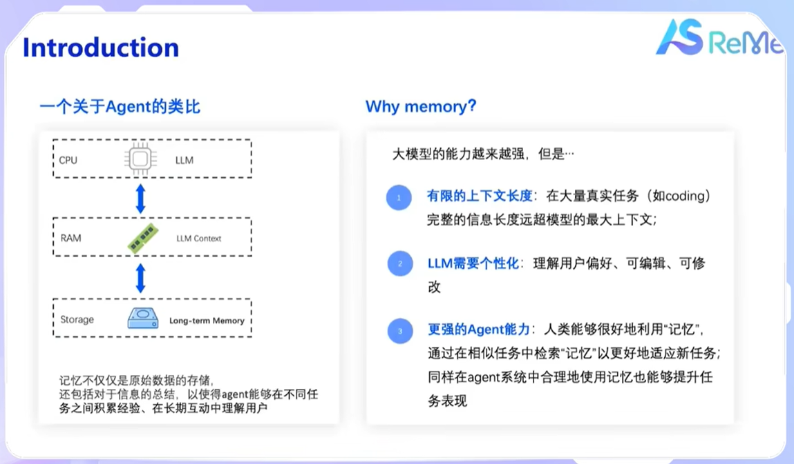
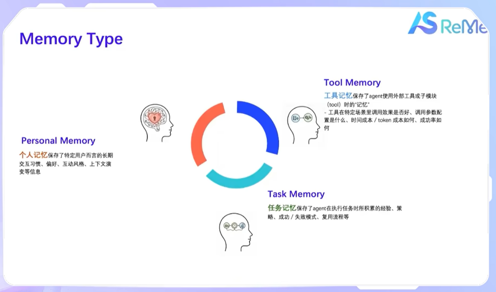

# 让AI真正"记住你"：ReMe长期记忆框架

## 一、前言

> 你有没有遇到过这样的场景：跟AI聊了一下午，它记住了你喜欢喝拿铁、讨厌香菜、周末爱爬山。结果第新打开一个对话框，它又变回了那个"初次见面"的陌生人——ChatGPT除外，现在网页ChatGPT已经有了长期记忆。
>
> 
当前绝大多数大模型，本质上都是"金鱼记忆"——每次对话结束，上下文清零，一切重来。

阿里云AgentScope团队推出的 ReMe（[Remember Me, Refine Me](https://arxiv.org/abs/2512.10696)），就是想解决这个问题：**让AI拥有真正的长期记忆**，不仅能记住你，还能从经验中学习，越用越聪明。

## 二、ReMe简介

### 记忆，不只是"存下来"

首先需要明确一个误区：_给AI加个数据库存聊天记录，就是"有记忆"了_ —— 或许在早两年的时候，这个说法还勉强站得住脚，但现在动态自主Agent场景下的真实情况要复杂得多。

官方的分享中打了个很形象的比方：如果把智能体比作一台电脑，大模型是CPU，负责思考计算；上下文窗口是内存，临时存放当前任务的信息；而长期记忆，应该是硬盘——存那些重要的、可复用的知识和经验。



但硬盘也不能随便塞。**人类记东西是有选择的**：

- 你会记住朋友爱喝什么咖啡，但不会记住他上周三午饭吃了什么
- 你会总结"这种类型的任务要分三步做"，但不会把每次操作的每一步都背下来
- 你会记住"这个工具用起来很顺手"，但不会背诵它的所有参数文档

好的记忆系统，要会筛选、会总结、会关联。这正是ReMe设计的出发点。

### 三种记忆，各司其职

ReMe把记忆分成三类，每类解决不同的问题：



#### 1. 个人记忆（Personal Memory）

> "记住你是谁，喜欢什么"

这类记忆关注用户本身：偏好、习惯、身份、沟通风格。

比如你说过"我喝咖啡不加糖""写代码喜欢用VS Code""回答问题希望简洁一点"。这些信息被提炼后存下来，下次对话时，AI就能主动适配你的风格，不用你反复强调。

**适用场景**：个人助理、客服机器人、陪伴型应用。

#### 2. 任务记忆（Task/Procedural Memory）

> "记住怎么做，哪里容易踩坑"

这类记忆关注"方法论"：某个任务怎么拆解、哪些步骤容易出错、什么策略更有效。

比如让AI帮你做市场调研，第一次它可能走了弯路；第二次，它能调取之前的经验："上次用A方法收集数据花了3小时但质量一般，这次试试B方案，效率高30%"。

论文里提到，这种"程序性记忆"能让智能体从"盲目试错"进化到"经验复用"。

**适用场景**：复杂任务自动化、代码生成、研究分析。

#### 3. 工具记忆（Tool Memory）

> "记住哪个工具好用，什么时候用"

这类记忆关注"工具使用经验"：某个API在什么场景下响应快、哪个函数参数容易填错、组合调用时有什么技巧。

比如搜索工具，有时候用关键词精准匹配更好，有时候用语义模糊搜索更全面。工具记忆会记录这些"手感"，下次自动推荐更合适的调用方式。

**适用场景**：多工具协同、自动化工作流、低代码平台。

### 核心机制：记住、提炼、复用

除了记忆分类，更关键的是怎么让记忆"活"起来。ReMe设计了三个核心环节：

#### 1. 经验蒸馏：从"流水账"到"干货"

不是所有对话都值得存。ReMe会主动分析：

- 成功的操作：提取关键步骤和决策逻辑
- 失败的尝试：记录触发条件和避坑建议
- 重复的模式：归纳通用策略，避免重复劳动

就像整理笔记，不会把老师每句话都抄下来，而是提炼重点、标注疑问、关联知识点。

#### 2. 情境适配：知道"什么时候用哪条"

存了100条记忆，查询时怎么快速找到相关的？

ReMe采用"场景感知索引"：不仅看关键词匹配，还会结合当前任务类型、用户身份、时间上下文等多维度判断。

举个例子：你问"怎么安排杭州行程"，系统会优先调取"旅游规划"相关的任务记忆，而不是"代码调试"的经验。

#### 3. 自主精炼：记忆也会"过期"

人的记忆会模糊、会更新，AI的记忆也该如此。

ReMe引入了"基于效用的修剪机制"：

- 长期没被调用的记忆，权重会逐渐降低
- 与新经验冲突的旧记忆，会被标记待更新
- 高频使用的核心记忆，会被强化和细化

这样既能防止记忆库无限膨胀，又能保证"常用常新"。


### 两种使用模式

ReMe支持**两种使用模式**：

| 模式           | 谁来决定"记什么"                      | 适合场景                 |
| -------------- | ------------------------------------- | ------------------------ |
| **开发者控制** | 你在代码里显式调用`record`/`retrieve` | 逻辑明确、流程固定的应用 |
| **Agent自主**  | AI自己判断何时记录、何时查询          | 开放对话、探索型任务     |


## 三、开箱即用，快速启动

### Quick Start

那，既然功能这么强，接入会不会很复杂？

其实相反，ReMe的设计哲学就是"开箱即用"，只需要一句命令行就可以快速启动部署，无痛部署为 **Http服务** 或者 **MCP服务**。

> 但是这里小声吐槽：官方给的 [Github Page](https://reme.agentscope.io/library/library.html) 访问404是怎么个事儿？要找到使用说明还得去仓库里面翻

部署之前，需要注意先配置几个环境变量：

```shell
# Alibaba Cloud Bailian / DashScope / OpenAI Compatible API
FLOW_LLM_API_KEY=sk-xxxxxxxxxxxxxxxx
FLOW_LLM_BASE_URL=https://dashscope.aliyuncs.com/compatible-mode/v1

# ----- Embedding Model Configuration (Optional, can be omitted if same as LLM) -----
FLOW_EMBEDDING_API_KEY=sk-xxxxxxxxxxxxxxxx
FLOW_EMBEDDING_BASE_URL=https://dashscope.aliyuncs.com/compatible-mode/v1
```


从 [ReMe Quick Start](https://gitee.com/chenfei6095/ReMe/blob/main/docs/quick_start.md#http-service-startup) 中可以看到，安装好ReMe所需的依赖环境后，可通过下面的命令一键完成服务部署：

- HTTP 服务

```shell
reme \
  backend=http \
  http.port=8002 \
  llm.default.model_name=qwen3-30b-a3b-thinking-2507 \
  embedding_model.default.model_name=text-embedding-v4 \
  vector_store.default.backend=local
```

- MCP 服务

```shell
reme \
  backend=mcp \
  mcp.transport=stdio \
  llm.default.model_name=qwen3-30b-a3b-thinking-2507 \
  embedding_model.default.model_name=text-embedding-v4 \
  vector_store.default.backend=local
```

然后就可以看到启动日志：

```shell
2026-04-20 00:28:16.480 | INFO     | flowllm.core.utils.common_utils:load_env:123 - load env_path=.env
2026-04-20 00:28:16.916 | INFO     | flowllm.core.utils.pydantic_config_parser:parse_args:342 - load config=D:\ProgramFiles\MiniConda\envs\reme-serve\Lib\site-packages\reme_ai\config\default.yaml
2026-04-20 00:28:17 | INFO | local_vector_store.py:47 | LocalVectorStore initialized with store_dir=./local_vector_store


╭─ ReMe ────────────────────────────────────────╮
│                                               │
│        ____       __  ___                     │
│       / __ \___  /  |/  /__                   │
│      / /_/ / _ \/ /|_/ / _ \                  │
│     / _, _/  __/ /  / /  __/                  │
│    /_/ |_|\___/_/  /_/\___/                   │
│                                               │
│                                               │
│                                               │
│    📦 Backend:         http                   │
│    🔗 URL:             http://0.0.0.0:8002    │
│                                               │
│    🚀 FlowLLM version: 0.2.0.10               │
│    📚 FastAPI version: 0.135.2                │
│                                               │
╰───────────────────────────────────────────────╯


2026-04-20 00:28:17 | INFO | base_service.py:74 | integrate retrieve_task_memory,summary_task_memory,retrieve_task_memory_simple,summary_task_memory_simple,retrieve_personal_memory
,summary_personal_memory,retrieve_tool_memory,add_tool_call_result,summary_tool_memory,use_mock_search,vector_store,record_task_memory,delete_task_memory,react,agentic_retrieve,summary_working_memory,grep_working_memory,read_working_memory,summary_working_memory_for_as
INFO:     Started server process [15560]
INFO:     Waiting for application startup.
INFO:     Application startup complete.
INFO:     Uvicorn running on http://0.0.0.0:8002 (Press CTRL+C to quit)

```


### 命令机制解析

真实场景中使用时，可能仅依靠Quick Start的命令是不够的，往往还需要一些个性化配置。此时，了解框架的启动、配置原理就很必要。

#### 1. 命令入口机制

首先是Python Entry Point 配置，在 `pyproject.toml` 中定义了命令行入口点 ：

```toml
[project.scripts]
reme = "reme_ai.main:main"        # 主入口：启动HTTP/MCP服务
reme2 = "reme.reme:main"          # 备用入口
remecli = "reme.reme_cli:main"    # CLI交互模式
```

当执行 `pip install -e .` （安装上reme）后，Python 会自动生成 `reme` 可执行命令，调用 `reme_ai.main:main` 函数。

然后进一步看 main() 函数执行流程：

```python
def main():
    """Entry point for running ReMeApp as a service."""
    with ReMeApp(*sys.argv[1:]) as app:  # ① 解析命令行参数并初始化应用
        app.run_service()                  # ② 启动HTTP/MCP服务
```

可以看到几个关键特点：

- `*sys.argv[1:]`：将命令行参数（如 `backend=http http.port=8002`）直接传递给应用初始化
- `with` 上下文管理器：确保服务优雅关闭和资源释放
- `run_service()`：由父类 `FlowLLM.Application` 提供，根据配置启动相应后端

#### 2. 配置解析机制

ReMe命令配置解析依赖于内置的 `ConfigParser `，继承链如下：

```tex
reme_ai.config.config_parser.ConfigParser
    ↓ 继承
flowllm.core.utils.PydanticConfigParser
    ↓ 基于
Pydantic + YAML 解析
```

配置加载优先级从高到低为：

```tex
1. 命令行参数 (sys.argv[1:])
   ↓ 覆盖
2. 环境变量 (FLOW_LLM_API_KEY 等)
   ↓ 覆盖  
3. 自定义配置文件 (config_path 参数)
   ↓ 覆盖
4. 默认配置文件 (reme_ai/config/default.yaml)
```

参数解析格式支持 点号分隔的嵌套配置：

```shell
reme \
  backend=http \                          # 顶层配置
  http.port=8002 \                        # http.port 嵌套配置
  llm.default.model_name=qwen3-30b... \   # llm.default.model_name 三级嵌套
  embedding_model.default.model_name=text-embedding-v4 \
  vector_store.default.backend=memory
```

上述配置等价于 YAML 结构：

```yaml
backend: http
http:
  port: 8002
llm:
  default:
    model_name: qwen3-30b-a3b-thinking-2507
embedding_model:
  default:
    model_name: text-embedding-v4
vector_store:
  default:
    backend: memory
```

从前文的启动日志中可以看到，默认使用的配置是内置的 `default.yaml`，完整配置见：[default.yaml](https://gitee.com/chenfei6095/ReMe/blob/main/reme_ai/config/default.yaml)。实际开发场景中，可以通过 ReMe 提供的 `config_path` 参数，手动指定自定义的 YAML 配置文件：

```shell
reme \
  config_path=my_config.yaml \
  backend=http \
  http.port=8002
```

如果是需要通过自定义Python工程部署ReMe服务，可通过Python代码指定：

```python
from reme_ai import ReMeApp

# 通过 config_path 参数加载自定义配置
app = ReMeApp(
    config_path="path/to/my_config.yaml",  # 指定配置文件
    "llm.default.model_name=qwen3-30b...",  # 命令行参数仍可叠加覆盖
)

async with app:
    result = await app.async_execute("retrieve_task_memory", query="...")
```


## 四、自定义扩展开发

通常来讲，官方框架集成的对几类记忆进行检索、总结的API服务，如 `retrieve_task_memory`, `summary_task_memory` 等应是能够满足多数的场景，本地存储的数据中，By User作为一个 WorkPlace，单独存放为一个 `.jsonl` 文件，其中包含了文本信息、向量、关键元信息等：


但若需更定制化地部署，同样也是支持的，此时将reme作为开发包，自行开发扩展逻辑，并部署Fastapi应用即可，代码示例可参考[官方的代码示例](https://gitee.com/chenfei6095/ReMe/blob/main/tests/light/test_reme_light.py)。

## 五、写在最后：记忆，是进化的开始

记得25年Agent概念刚火的时候，跟组里大哥们吹牛皮，期待未来的Agent能够具备长期记忆、会自我进化，时至今日，这件事情已经成为了现实，ReMe是答案之一。我们常期待AI能"懂我"，而"懂"的前提，是"记得"。

记得你说过什么、做过什么、偏好什么；记得哪些方法有效、哪些坑要避开；记得在不同场景下，该怎么调整策略。

ReMe 的价值，不只是加了一个"记忆模块"，而是提供了一套**让智能体持续进化的基础设施**：

- 对个人：越聊越懂你，服务更贴心
- 对任务：越做越熟练，效率更高
- 对工具：越用越顺手，协作更流畅

目前ReMe支持多种向量数据库后端，文档和示例也相对完善，在阿里自己的私人助理Agent CoPaw中已得以应用，未来构建企业级智能应用，或许可以进行尝试。

> 项目名ReMe，既是"Remember Me"（记住），也是"Refine Me"（精进）。好的记忆，不该是负担，而应该是成长的阶梯。


## 六、相关资源

- 论文：[Remember Me, Refine Me](https://arxiv.org/abs/2512.10696) 
- 代码：[Github](https://github.com/agentscope-ai/ReMe/blob/main/README_ZH.md)、[Gitee](https://gitee.com/chenfei6095/ReMe/blob/main/README_ZH.md)  
- 教程：[AgentScope文档 - 长期记忆](https://java.agentscope.io/zh/task/memory.html#long-term-memory)、[AgentScope-ReMe](https://github.com/agentscope-ai/agentscope-java/tree/main/agentscope-extensions/agentscope-extensions-reme)  
- 视频：[B站开发者教程](https://www.bilibili.com/video/BV14qkfBnEeZ/)  
