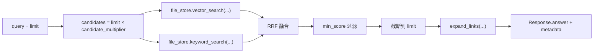

# ReMe MCP Server 工具参考手册

> 基于 ReMe v0.4.1.0 源码分析，整理 ReMe 作为 MCP Server 暴露的所有工具的详细用法。

## 目录

- [1. 架构概览](#1-架构概览)
- [2. 工具总览](#2-工具总览)
- [3. 文件操作类工具](#3-文件操作类工具)
  - [3.1 list — 文件列表](#31-list--文件列表)
  - [3.2 read — 读取文件](#32-read--读取文件)
  - [3.3 write — 写入文件](#33-write--写入文件)
  - [3.4 edit — 编辑文件](#34-edit--编辑文件)
  - [3.5 delete — 删除文件](#35-delete--删除文件)
  - [3.6 move — 移动/重命名文件](#36-move--移动重命名文件)
  - [3.7 stat — 文件状态](#37-stat--文件状态)
  - [3.8 read_image — 读取图片](#38-read_image--读取图片)
- [4. Frontmatter 操作工具](#4-frontmatter-操作工具)
  - [4.1 frontmatter_read — 读取 frontmatter](#41-frontmatter_read--读取-frontmatter)
  - [4.2 frontmatter_update — 更新 frontmatter](#42-frontmatter_update--更新-frontmatter)
  - [4.3 frontmatter_delete — 删除 frontmatter 字段](#43-frontmatter_delete--删除-frontmatter-字段)
- [5. Daily Note 工具](#5-daily-note-工具)
  - [5.1 daily_write — 写入 daily note](#51-daily_write--写入-daily-note)
  - [5.2 daily_list — 列出 daily notes](#52-daily_list--列出-daily-notes)
  - [5.3 daily_reindex — 重建 daily 索引页](#53-daily_reindex--重建-daily-索引页)
- [6. 检索工具](#6-检索工具)
  - [6.1 search — 混合检索](#61-search--混合检索)
  - [6.2 node_search — Digest 节点召回](#62-node_search--digest-节点召回)
  - [6.3 traverse — Wikilink 图遍历](#63-traverse--wikilink-图遍历)
- [7. 自动记忆工具](#7-自动记忆工具)
  - [7.1 auto_memory — 对话记忆写入](#71-auto_memory--对话记忆写入)
  - [7.2 auto_resource — 资源解读写入](#72-auto_resource--资源解读写入)
  - [7.3 auto_dream — Daily 到 Digest 沉淀](#73-auto_dream--daily-到-digest-沉淀)
  - [7.4 proactive — 主动兴趣主题读取](#74-proactive--主动兴趣主题读取)
- [8. 系统工具](#8-系统工具)
  - [8.1 version — 版本信息](#81-version--版本信息)
  - [8.2 health_check — 健康检查](#82-health_check--健康检查)
  - [8.3 status — 状态报告](#83-status--状态报告)
  - [8.4 help — 帮助信息](#84-help--帮助信息)
  - [8.5 reindex — 重建索引](#85-reindex--重建索引)
  - [8.6 shell — 执行 Shell 命令](#86-shell--执行-shell-命令)
- [9. MCP 响应格式规范](#9-mcp-响应格式规范)
- [10. 用户隔离机制](#10-用户隔离机制)
- [11. 已知问题与注意事项](#11-已知问题与注意事项)

---

## 1. 架构概览

ReMe 的运行时架构为：**配置驱动的 Application 装配组件和 Job，Service 将可服务的 Job 暴露为 MCP 工具，Job 再按顺序执行 Step**。

```
MCP Client (HiveMind Java)
  → MCP SSE Transport
    → MCPService (FastMCP)
      → BaseJob
        → Steps (业务原子操作)
          → Components (file_store, file_graph, keyword_index, etc.)
            → Workspace (daily/ digest/ resource/ metadata/ session/)
```

### 核心分层

| 层 | 主要目录 | 职责 |
|---|---|---|
| Service | `reme/components/service/` | 把 Job 注册为 MCP tool |
| Application | `reme/application.py` | 配置解析、组件装配、Job 调用 |
| Job | `reme/components/job/` | 编排一组 Step |
| Step | `reme/steps/` | 业务原子操作（读写文件、检索、索引等） |
| Component | `reme/components/` | 可复用基础设施（file_store, file_graph 等） |

### MCP 服务注册机制

`MCPService.add_job()` 方法将每个非流式 Job 包装为一个 MCP tool：

```python
async def execute_tool(**kwargs):
    response = await job(**kwargs)
    return response.answer  # ⚠️ 只返回 answer，metadata 被丢弃
```

**关键点**：MCP tool 返回的是 `response.answer`（字符串），而结构化数据存储在 `response.metadata` 中。这是一个已知的数据丢失问题（见 [第 11 节](#11-已知问题与注意事项)）。

---

## 2. 工具总览

ReMe MCP Server 暴露的全部工具按功能分为 6 类：

| 类别 | 工具名 | 说明 |
|---|---|---|
| **文件操作** | `list`, `read`, `write`, `edit`, `delete`, `move`, `stat`, `read_image` | 工作区文件的 CRUD 操作 |
| **Frontmatter** | `frontmatter_read`, `frontmatter_update`, `frontmatter_delete` | Markdown 文件元数据操作 |
| **Daily Note** | `daily_write`, `daily_list`, `daily_reindex` | 每日记忆卡片管理 |
| **检索** | `search`, `node_search`, `traverse` | 记忆检索与图遍历 |
| **自动记忆** | `auto_memory`, `auto_resource`, `auto_dream`, `proactive` | 自动化记忆沉淀流程 |
| **系统** | `version`, `health_check`, `status`, `help`, `reindex`, `shell` | 系统管理工具 |

---

## 3. 文件操作类工具

### 3.1 list — 文件列表

**功能**：列出工作区指定目录下的文件。

**源码位置**：`reme/steps/file_io/list.py` → `ListStep`

**入参**：

| 参数 | 类型 | 必填 | 默认值 | 说明 |
|---|---|---|---|---|
| `path` | string | 否 | `""` | 工作区相对路径，空字符串表示根目录 |
| `recursive` | boolean | 否 | `false` | 是否递归列出子目录 |
| `limit` | integer | 否 | `100` | 返回文件数量上限 |

**出参**（`response`）：

| 字段 | 类型 | 说明 |
|---|---|---|
| `answer` | string | 人类可读摘要，如 `"Listed 4 file(s) under user-001/"` |
| `metadata.items` | string[] | 文件路径列表（工作区相对路径） |
| `metadata.count` | integer | 文件数量 |

**MCP 实际返回**：⚠️ **只返回 `answer` 字符串**，不包含 `metadata.items`。这是一个已知 bug。

**原理**：
1. 从磁盘直接遍历文件系统（`Path.iterdir` / `Path.rglob`），**不使用** file_store 索引
2. 只返回常规文件（跳过目录、socket、断链等）
3. 路径格式为工作区相对路径

**示例调用**：
```json
{
  "path": "daily/2026-07-12",
  "recursive": true,
  "limit": 50
}
```

---

### 3.2 read — 读取文件

**功能**：读取工作区中的 Markdown 文件内容，支持行范围切片。

**源码位置**：`reme/steps/file_io/read.py` → `ReadStep`

**入参**：

| 参数 | 类型 | 必填 | 默认值 | 说明 |
|---|---|---|---|---|
| `path` | string | **是** | - | 工作区相对路径（Markdown 文件） |
| `start_line` | integer | 否 | `1` | 起始行号（1-based，包含） |
| `end_line` | integer | 否 | 文件末尾 | 结束行号（1-based，包含） |

**出参**（`response`）：

| 字段 | 类型 | 说明 |
|---|---|---|
| `answer` | string | 文件内容文本，带行号和文件路径头部 |
| `success` | boolean | 是否成功 |

**原理**：
1. 解析路径，自动补全 `.md` 后缀（非 md 文件会警告但不阻断）
2. 小文件直接全文读取，大文件使用流式行读取
3. 支持 `start_line`/`end_line` 行范围切片
4. 可选启用 `with_neighbors`（Step 配置级），读取后展开 wikilink 邻居

**返回格式示例**：
```
--- file: daily/2026-07-12/session-a.md (total 45 lines) ---
  1  ---
  2  name: 用户偏好记录
  3  description: 用户偏好 Markdown 格式的技术文档
  4  ---
  ...
```

---

### 3.3 write — 写入文件

**功能**：创建或覆盖写入一个 Markdown 文件，自动写入 `name` 和 `description` frontmatter。

**源码位置**：`reme/steps/file_io/write.py` → `WriteStep`

**入参**：

| 参数 | 类型 | 必填 | 默认值 | 说明 |
|---|---|---|---|---|
| `path` | string | **是** | - | 工作区相对路径 |
| `name` | string | **是** | - | frontmatter `name` 字段 |
| `description` | string | **是** | - | frontmatter `description` 字段 |
| `content` | string | **是** | - | 正文内容（不含 frontmatter） |
| `metadata` | object | 否 | `{}` | 额外 frontmatter 字段 |

**出参**（`response`）：

| 字段 | 类型 | 说明 |
|---|---|---|
| `answer` | string | 写入结果摘要 |
| `success` | boolean | 是否成功 |

**原理**：
1. 路径没有 `.md` 后缀时自动补全
2. 自动生成 YAML frontmatter（`---` 包裹的 `name`、`description` 和额外 metadata）
3. 自动创建必要的父目录
4. 写入后触发文件监听，自动更新索引

**生成的文件格式**：
```markdown
---
name: 文档名
description: 文档描述
tags: [tag1, tag2]
---

正文内容...
```

---

### 3.4 edit — 编辑文件

**功能**：在 Markdown 文件中执行查找替换（所有匹配项）。

**源码位置**：`reme/steps/file_io/edit.py` → `EditStep`

**入参**：

| 参数 | 类型 | 必填 | 默认值 | 说明 |
|---|---|---|---|---|
| `path` | string | **是** | - | 工作区相对路径 |
| `old` | string | **是** | - | 要查找的文本 |
| `new` | string | **是** | `""` | 替换文本 |

**出参**（`response`）：

| 字段 | 类型 | 说明 |
|---|---|---|
| `answer` | string | 编辑结果摘要 |
| `success` | boolean | 是否成功 |

**原理**：
1. 读取文件全文
2. 执行字符串替换（`str.replace(old, new)`，替换所有匹配项）
3. 写回文件
4. 触发索引更新

---

### 3.5 delete — 删除文件

**功能**：删除工作区中的文件或目录，返回仍指向该文件的入边 wikilinks。

**源码位置**：`reme/steps/file_io/delete.py` → `DeleteStep`

**入参**：

| 参数 | 类型 | 必填 | 默认值 | 说明 |
|---|---|---|---|---|
| `path` | string | **是** | - | 工作区相对路径 |

**出参**（`response`）：

| 字段 | 类型 | 说明 |
|---|---|---|
| `answer` | string | 删除结果，包含仍存在的入边信息 |
| `metadata.surviving_inlinks` | list | 仍指向被删文件的 wikilink 列表 |

**原理**：
1. 删除前检查 file_graph 中的入边（inlinks）
2. 删除文件
3. 从 file_store、keyword_index、file_graph 中清除相关记录
4. 返回仍存在的入边，方便调用方清理悬空引用

---

### 3.6 move — 移动/重命名文件

**功能**：移动或重命名工作区文件，默认自动改写入边中的 wikilink 路径。

**源码位置**：`reme/steps/file_io/move.py` → `MoveStep`

**入参**：

| 参数 | 类型 | 必填 | 默认值 | 说明 |
|---|---|---|---|---|
| `src_path` | string | **是** | - | 源路径（工作区相对） |
| `dst_path` | string | **是** | - | 目标路径（工作区相对） |
| `overwrite` | boolean | 否 | `false` | 目标存在时是否覆盖 |
| `retarget` | boolean | 否 | `true` | 是否自动改写入边中的 `[[src]]` → `[[dst]]` |

**出参**（`response`）：

| 字段 | 类型 | 说明 |
|---|---|---|
| `answer` | string | 移动结果摘要 |
| `metadata.retargeted` | integer | 被改写的 wikilink 数量 |

**原理**：
1. 移动文件
2. 如果 `retarget=true`，扫描所有引用旧路径的文件，将 `[[旧路径]]` 替换为 `[[新路径]]`
3. 更新 file_store、file_graph 中的路径映射

---

### 3.7 stat — 文件状态

**功能**：获取工作区文件的元信息。

**源码位置**：`reme/steps/file_io/stat.py` → `StatStep`

**入参**：

| 参数 | 类型 | 必填 | 默认值 | 说明 |
|---|---|---|---|---|
| `path` | string | **是** | - | 工作区相对路径 |

**出参**（`response`）：

| 字段 | 类型 | 说明 |
|---|---|---|
| `answer` | string | 文件状态摘要 |
| `metadata.exists` | boolean | 文件是否存在 |
| `metadata.is_file` | boolean | 是否为文件 |
| `metadata.is_dir` | boolean | 是否为目录 |
| `metadata.size` | integer | 文件大小（字节） |
| `metadata.mtime` | float | 最后修改时间戳 |

---

### 3.8 read_image — 读取图片

**功能**：读取图片文件并以 base64 编码返回。

**源码位置**：`reme/steps/file_io/read_image.py` → `ReadImageStep`

**入参**：

| 参数 | 类型 | 必填 | 默认值 | 说明 |
|---|---|---|---|---|
| `path` | string | **是** | - | 工作区相对路径，支持 png/jpg/jpeg/webp/gif/bmp/tiff/heic |

**出参**（`response`）：

| 字段 | 类型 | 说明 |
|---|---|---|
| `answer` | string | base64 编码的图片数据 |
| `metadata.format` | string | 图片格式 |
| `metadata.size` | integer | 文件大小 |

**限制**：默认最大 5MB（`max_bytes: 5242880`）。

---

## 4. Frontmatter 操作工具

### 4.1 frontmatter_read — 读取 frontmatter

**功能**：读取 Markdown 文件的 YAML frontmatter，返回为字典。

**入参**：

| 参数 | 类型 | 必填 | 默认值 | 说明 |
|---|---|---|---|---|
| `path` | string | **是** | - | 工作区相对路径 |

**出参**（`response`）：

| 字段 | 类型 | 说明 |
|---|---|---|
| `answer` | string | frontmatter JSON 字符串 |
| `metadata.frontmatter` | object | 解析后的 frontmatter 键值对 |

**原理**：解析文件开头 `---` 之间的 YAML 内容，返回所有键值对。

---

### 4.2 frontmatter_update — 更新 frontmatter

**功能**：将新的键值对合并到文件的 frontmatter 中（增量更新，不覆盖未提及的字段）。

**入参**：

| 参数 | 类型 | 必填 | 默认值 | 说明 |
|---|---|---|---|---|
| `path` | string | **是** | - | 工作区相对路径 |
| `metadata` | object | **是** | - | 要合并的键值对 |

**出参**（`response`）：

| 字段 | 类型 | 说明 |
|---|---|---|
| `answer` | string | 更新结果摘要 |

**原理**：
1. 读取现有 frontmatter
2. 合并新键值对（新值覆盖旧值，未提及的旧键保留）
3. 写回文件

---

### 4.3 frontmatter_delete — 删除 frontmatter 字段

**功能**：从文件的 frontmatter 中删除指定的键。

**入参**：

| 参数 | 类型 | 必填 | 默认值 | 说明 |
|---|---|---|---|---|
| `path` | string | **是** | - | 工作区相对路径 |
| `keys` | string[] | **是** | - | 要删除的键名列表 |

**出参**（`response`）：

| 字段 | 类型 | 说明 |
|---|---|---|
| `answer` | string | 删除结果摘要 |

---

## 5. Daily Note 工具

### 5.1 daily_write — 写入 daily note

**功能**：写入一条 daily 记忆卡片，自动关联 session_id 和日期。

**入参**：

| 参数 | 类型 | 必填 | 默认值 | 说明 |
|---|---|---|---|---|
| `name` | string | **是** | - | 文件名 stem 和 frontmatter name |
| `description` | string | **是** | - | frontmatter description |
| `session_id` | string | **是** | - | 来源会话标识 |
| `content` | string | **是** | - | 正文内容 |
| `date` | string | 否 | `""` | 目标日期 `YYYY-MM-DD`，空则使用今天 |
| `metadata` | object | 否 | `{}` | 额外 frontmatter 字段 |

**出参**（`response`）：

| 字段 | 类型 | 说明 |
|---|---|---|
| `answer` | string | 写入结果摘要 |
| `metadata.path` | string | 实际写入的文件路径 |

**写入位置**：`daily/<YYYY-MM-DD>/<name>.md`

**生成的 frontmatter**：
```yaml
---
name: session-a
description: 对话摘要
session_id: session-a
---
```

---

### 5.2 daily_list — 列出 daily notes

**功能**：列出指定日期下所有 daily note 文件及其 frontmatter。

**入参**：

| 参数 | 类型 | 必填 | 默认值 | 说明 |
|---|---|---|---|---|
| `date` | string | 否 | `""` | 日期 `YYYY-MM-DD`，空则使用今天 |

**出参**（`response`）：

| 字段 | 类型 | 说明 |
|---|---|---|
| `answer` | string | 人类可读的 note 列表 |
| `metadata.notes` | object[] | 结构化的 note 信息列表 |
| `metadata.count` | integer | note 数量 |
| `metadata.date` | string | 实际查询的日期 |

**answer 格式示例**：
```
- path: daily/2026-07-12/session-a.md name: session-a description: 对话摘要 session_id: session-a
- path: daily/2026-07-12/session-b.md name: session-b description: 另一段对话
```

**原理**：
1. 扫描 `daily/<date>/` 目录下的所有 `.md` 文件（排除 `interests.yaml` 和索引页）
2. 解析每个文件的 frontmatter
3. 按文件路径排序返回

---

### 5.3 daily_reindex — 重建 daily 索引页

**功能**：重新生成当天的索引页 `daily/<date>.md`。

**入参**：

| 参数 | 类型 | 必填 | 默认值 | 说明 |
|---|---|---|---|---|
| `date` | string | 否 | `""` | 日期 `YYYY-MM-DD`，空则使用今天 |

**出参**（`response`）：

| 字段 | 类型 | 说明 |
|---|---|---|
| `answer` | string | 重建结果摘要 |
| `metadata.indexed_count` | integer | 索引的 note 数量 |

---

## 6. 检索工具

### 6.1 search — 混合检索

**功能**：混合检索（向量 + BM25，RRF 融合），支持 wikilink 链接展开。这是 ReMe 最核心的检索入口。

**源码位置**：`reme/steps/index/search.py` → `SearchStep`

**入参**：

| 参数 | 类型 | 必填 | 默认值 | 说明 |
|---|---|---|---|---|
| `query` | string | **是** | - | 搜索查询 |
| `limit` | integer | 否 | `5` | 最大返回结果数 |
| `min_score` | number | 否 | `0.0` | 最低融合分数阈值 |
| `start_date` | string | 否 | - | 起始日期过滤 `YYYY-MM-DD`（包含） |
| `end_date` | string | 否 | - | 结束日期过滤 `YYYY-MM-DD`（包含） |

**出参**（`response`）：

| 字段 | 类型 | 说明 |
|---|---|---|
| `answer` | string | 人类可读的搜索结果，含路径、行号、分数和 chunk 内容 |
| `metadata.results` | object[] | 结构化搜索结果 |
| `metadata.link_expansion` | object | wikilink 链接展开信息 |
| `metadata.counts` | object | 向量/关键词召回数量统计 |

**answer 格式示例**：
```
========== daily/2026-06-20/session-a.md:12-28 [score=0.0317 keyword=4.8120] ==========
...命中的记忆片段...
  outlinks (2):
    -> digest/indexing.md  name="Indexing"  description="..."
      via predicate=related
  inlinks (1):
    <- daily/2026-06-19.md  name="..."
      via plain
```

**检索原理**：



1. **候选召回**：同时执行向量搜索和 BM25 关键词搜索
2. **RRF 融合**：`fused_score = vector_weight / (60 + vector_rank) + keyword_weight / (60 + keyword_rank)`
3. **分数过滤**：过滤掉低于 `min_score` 的结果
4. **链接展开**：对命中文件展开最多 10 个 outlinks 和 inlinks

**注意**：默认配置下 embedding store 未启用，实际只有 BM25 关键词检索。

---

### 6.2 node_search — Digest 节点召回

**功能**：专门用于 digest 节点级的召回，服务于 Auto Dream 的去重和链接发现。只返回节点摘要（name、description），不展开正文。

**入参**：

| 参数 | 类型 | 必填 | 默认值 | 说明 |
|---|---|---|---|---|
| `query` | string | **是** | - | 搜索查询 |
| `limit` | integer | 否 | `20` | 最大返回节点数 |

**出参**（`response`）：

| 字段 | 类型 | 说明 |
|---|---|---|
| `answer` | string | 人类可读的节点列表 |
| `metadata.results` | object[] | digest 节点信息（path, name, description 等） |

**与 search 的区别**：

| 能力 | `search` | `node_search` |
|---|---|---|
| 用途 | 面向用户问答 | 面向 Dream 集成的去重和链接 |
| 返回粒度 | chunk 级（正文片段） | 节点级（frontmatter 摘要） |
| 链接展开 | ✅ 展开 outlinks/inlinks | ❌ 不展开 |
| 搜索范围 | daily + digest + resource | 仅 digest |

---

### 6.3 traverse — Wikilink 图遍历

**功能**：从指定路径出发，沿 wikilink 图谱进行深度遍历。

**入参**：

| 参数 | 类型 | 必填 | 默认值 | 说明 |
|---|---|---|---|---|
| `path` | string | **是** | - | 起始路径 |
| `depth` | integer | 否 | `1` | 遍历深度（跳数限制） |
| `direction` | string | 否 | `"both"` | 遍历方向：`forward`、`backward`、`both` |

**出参**（`response`）：

| 字段 | 类型 | 说明 |
|---|---|---|
| `answer` | string | 图遍历结果，展示节点间的链接关系 |
| `metadata.visited` | object[] | 访问过的节点列表 |
| `metadata.edges` | object[] | 遍历到的边列表 |

---

## 7. 自动记忆工具

### 7.1 auto_memory — 对话记忆写入

**功能**：将对话消息自动整理成 daily 记忆卡片。这是 ReMe 的核心对话记忆入口。

**源码位置**：`reme/steps/evolve/auto_memory.py`

**入参**：

| 参数 | 类型 | 必填 | 默认值 | 说明 |
|---|---|---|---|---|
| `messages` | object[] | **是** | - | 消息列表，每条含 `role` 和 `content` |
| `session_id` | string | 否 | `""` | 会话标识，用于生成独立的记忆卡片 |
| `memory_hint` | string | 否 | - | 给 LLM 的额外指导提示 |
| `date` | string | 否 | `""` | 目标日期 `YYYY-MM-DD`，空则从消息时间推断或使用今天 |

**messages 格式**：
```json
[
  {"role": "user", "content": "我偏好 Markdown 格式的技术文档", "created_at": "2026-07-12T10:00:00"},
  {"role": "assistant", "content": "已记录您的偏好。", "created_at": "2026-07-12T10:01:00"}
]
```

**出参**（`response`）：

| 字段 | 类型 | 说明 |
|---|---|---|
| `answer` | string | 记忆写入结果摘要 |
| `metadata.daily_path` | string | 生成的 daily note 路径 |
| `metadata.session_path` | string | 原始对话 JSONL 路径 |

**记忆写入位置**：
```
daily/<YYYY-MM-DD>/<session_id>.md    ← 整理后的记忆卡片
session/dialog/<session_id>.jsonl      ← 原始对话保存
```

**原理**：
1. 将消息保存为原始 JSONL（`session/dialog/` 目录）
2. 使用 LLM 从对话中提取值得长期记忆的内容（用户偏好、关键事实、过程决定、当前状态、可复用经验）
3. 生成 daily note，包含 frontmatter 和结构化正文
4. 自动更新当天索引页

**时间戳处理**：支持多种时间字段名：`created_at`、`time_created`、`timestamp`、`createdAt`、`timeCreated`、`created_time`，可在消息顶层或 `metadata` 中。

---

### 7.2 auto_resource — 资源解读写入

**功能**：将外部资源文件解读为 daily 资源卡片。

**入参**：

| 参数 | 类型 | 必填 | 默认值 | 说明 |
|---|---|---|---|---|
| `changes` | object[] | **是** | - | 资源变更列表 |

**changes 格式**：
```json
[
  {"path": "resource/2026-07-12/report.md", "change": "added"},
  {"path": "resource/2026-07/old-report.md", "change": "deleted"}
]
```

每个 change 项含 `path`（或 `file_path`）和 `change`（`added`/`modified`/`deleted`）。

**出参**（`response`）：

| 字段 | 类型 | 说明 |
|---|---|---|
| `answer` | string | 资源解读结果摘要 |
| `metadata.processed` | integer | 处理的资源数量 |

**写入位置**：`daily/<YYYY-MM-DD>/<生成的文件名>.md`

**原理**：
1. 读取资源文件内容
2. 使用 LLM 提炼核心内容、结构脉络、关键细节、背景用途、可行动项
3. 生成 daily note，frontmatter 中 `source_resource` 指向原始文件
4. 文件名由 LLM 生成的 `name` 决定

---

### 7.3 auto_dream — Daily 到 Digest 沉淀

**功能**：扫描 daily 输入，将值得长期保留的内容抽取并整合进 digest 长期记忆层，同时生成主动兴趣主题。

**入参**：

| 参数 | 类型 | 必填 | 默认值 | 说明 |
|---|---|---|---|---|
| `date` | string | 否 | `""` | 目标日期 `YYYY-MM-DD`，空则使用今天 |
| `hint` | string | 否 | `""` | 给抽取和整合阶段的额外指导 |
| `scan_days` | integer | 否 | `2` | 扫描最近几天的 daily 目录 |
| `max_units` | integer | 否 | `5` | 最大抽取记忆单元数 |
| `topic_count` | integer | 否 | `3` | 写入 interests.yaml 的主题上限 |
| `topic_diversity_days` | integer | 否 | `7` | 参考过去几天的 interests 避免重复 |

**出参**（`response`）：

| 字段 | 类型 | 说明 |
|---|---|---|
| `answer` | string | dream 流程摘要（scanned、changed、integrated、topics 等计数） |
| `metadata.integrate_results` | object[] | 整合结果 |
| `metadata.failed_units` | object[] | 失败的记忆单元 |
| `metadata.topics` | object[] | 最终写入的兴趣主题 |

**四个阶段**：

1. **Extract**：扫描 changed daily 文件，用 LLM 抽取 memory units 和 topics
2. **Integrate**：对每个 unit 独立调用 Agent，整合进 digest（CREATE / CORROBORATE / REFINE / CORRECT）
3. **Topics**：筛选并写入 `daily/<date>/interests.yaml`
4. **Finish**：checkpoint 成功处理的路径到 file_catalog

**输出位置**：
```
digest/procedure/*.md        ← 方法、流程、runbook
digest/personal/*.md         ← 用户偏好、长期个人事实
digest/wiki/*.md             ← 通用知识、概念、决策先例
daily/<date>/interests.yaml  ← 当天主动兴趣主题
```

---

### 7.4 proactive — 主动兴趣主题读取

**功能**：读取 `auto_dream` 写出的当天兴趣主题文件，不调用 LLM。

**入参**：

| 参数 | 类型 | 必填 | 默认值 | 说明 |
|---|---|---|---|---|
| `date` | string | 否 | `""` | 目标日期 `YYYY-MM-DD`，空则使用今天 |
| `include_content` | boolean | 否 | `true` | 是否返回 YAML 原文 |

**出参**（`response`）：

| 字段 | 类型 | 说明 |
|---|---|---|
| `answer` | string | 读取结果摘要 |
| `metadata.date` | string | 实际读取的日期 |
| `metadata.path` | string | interests.yaml 路径 |
| `metadata.topics` | object[] | 解析后的主题列表 |
| `metadata.content` | string | YAML 原文（仅 `include_content=true`） |
| `metadata.skipped` | boolean | 文件不存在时为 `true` |

**interests.yaml 格式**：
```yaml
date: 2026-07-12
topic_count: 3
diversity_days: 7
topics:
  - title: 记忆检索链路的质量回归
    reason: 用户近期持续修改 search 和 dream 集成链路
    evidence: daily/2026-07-12/session.md
    keywords: [memory search, auto dream]
    paths: [daily/2026-07-12/session.md]
```

---

## 8. 系统工具

### 8.1 version — 版本信息

**功能**：返回 ReMe 包版本号。

**入参**：无

**出参**：`answer` = 版本号字符串

---

### 8.2 health_check — 健康检查

**功能**：返回 ReMe 各组件的健康状态快照。

**入参**：无

**出参**：`answer` = 组件状态摘要

---

### 8.3 status — 状态报告

**功能**：报告有状态组件的内存估计和进程 RSS。

**入参**：无

**出参**：`answer` = 内存和状态信息

---

### 8.4 help — 帮助信息

**功能**：列出所有已注册的 Job 及其元数据。

**入参**：无

**出参**：`answer` = Job 列表及描述

---

### 8.5 reindex — 重建索引

**功能**：清除现有 file_store 并从磁盘文件重建索引。

**入参**：无

**出参**：`answer` = 重建结果摘要

**原理**：
1. 清除 file_store 中的所有数据
2. 扫描 `daily/`、`digest/`、`resource/` 目录
3. 重新解析所有文件，构建 chunk 索引、BM25 索引和 wikilink 图谱

---

### 8.6 shell — 执行 Shell 命令

**功能**：在工作区目录中异步执行 shell 命令。

**入参**：

| 参数 | 类型 | 必填 | 默认值 | 说明 |
|---|---|---|---|---|
| `cmd` | string | **是** | - | shell 命令 |
| `shell_timeout` | number | 否 | `86400` | 超时时间（秒） |

**出参**：`answer` = 命令执行结果

---

## 9. MCP 响应格式规范

### Response 数据结构

ReMe 的 `Response` 是 Pydantic 模型：

```python
class Response(BaseModel):
    answer: str | Any = ""           # 响应内容（人类可读文本或数据）
    success: bool = True             # 操作是否成功
    metadata: dict = {}              # 结构化元数据
```

### MCP 工具返回值

MCP Service 在注册工具时，`execute_tool` 只返回 `response.answer`：

```python
async def execute_tool(**kwargs):
    response = await job(**kwargs)
    return response.answer  # 只取 answer 字段
```

这意味着：
- **MCP 调用方只能获取 `answer` 字段的内容**
- **`metadata` 中的结构化数据（如 `list` 的文件列表、`search` 的结构化结果）对 MCP 调用方不可见**

### 各工具的 answer 格式特点

| 工具 | answer 格式 | 结构化数据在 metadata |
|---|---|---|
| `list` | `"Listed N file(s) under path"` | `items: string[]`, `count: int` |
| `read` | 文件内容文本（带行号） | - |
| `write` | 写入结果摘要 | - |
| `edit` | 编辑结果摘要 | - |
| `search` | 人类可读搜索结果 | `results`, `link_expansion`, `counts` |
| `daily_list` | 人类可读 note 列表 | `notes`, `count`, `date` |
| `auto_memory` | 记忆写入摘要 | `daily_path`, `session_path` |
| `auto_dream` | dream 流程摘要 | `integrate_results`, `topics` |
| `proactive` | 读取结果摘要 | `topics`, `content`, `skipped` |

---

## 10. 用户隔离机制

### HiveMind 的用户隔离

HiveMind 通过 `McpReMeClient` 的路径前缀机制实现用户隔离：

```java
// McpReMeClient.applyUserScope()
// 对文件操作类工具自动添加 userId/ 前缀
// 例如：user-001 调用 read(path="daily/2026-07-12.md")
// 实际访问的是 "user-001/daily/2026-07-12.md"
```

**需要用户隔离的工具**：
```java
Set.of(
    "read", "write", "edit", "list", "move", "delete",
    "read_image", "daily_write", "daily_list",
    "frontmatter_read", "frontmatter_update", "frontmatter_delete"
)
```

### 隔离原理

1. `path` 参数自动添加 `userId/` 前缀
2. 空 `path` → `userId/`（用户根目录）
3. 已有 `userId/` 前缀的路径不重复添加
4. `search` 和 `node_search` 通过 `UserScopedMcpTool` 的后过滤机制隔离结果

### 工作区目录结构（多用户）

```
<workspace_dir>/
  user-001/
    daily/
    digest/
    resource/
    session/
    metadata/
  user-002/
    daily/
    digest/
    ...
```

---

## 11. 已知问题与注意事项

### 11.1 MCP 丢弃 metadata 问题（已修复）

**问题**：`MCPService.add_job()` 中 `execute_tool` 只返回 `response.answer`，导致 `metadata` 中的结构化数据对 MCP 调用方不可见。

**影响**：
- `list` 工具返回 `"Listed 4 file(s) under user-001/"` 而非文件列表
- `search` 工具返回文本格式结果而非结构化 JSON
- `daily_list` 工具返回文本摘要而非 note 列表
- 所有在 `metadata` 中携带结构化数据的工具都受影响

**修复方案**：修改 `mcp_service.py`，当 `metadata` 非空时返回结构化 JSON（含 `answer` 和 `metadata` 两个字段）。

### 11.2 文件监听与索引延迟

- 文件操作（write/edit/delete/move）后，索引更新由后台 watcher 异步完成
- 在 watcher 处理完之前，`search` 可能返回过时结果
- 需要立即生效时可调用 `reindex` 手动触发

### 11.3 LLM 依赖

以下工具需要配置 LLM 才能完整工作：
- `auto_memory`（对话记忆抽取）
- `auto_resource`（资源解读）
- `auto_dream`（Extract 和 Integrate 阶段）

未配置 LLM 时，这些工具会失败。基础文件操作和 BM25 检索不需要 LLM。

### 11.4 路径约定

- 所有路径均为工作区相对路径
- Markdown 文件省略 `.md` 后缀时会自动补全
- Wikilink 使用字面路径语义：`[[digest/wiki/光伏.md]]` 就是指这个具体路径，不做标题搜索或同名解析
- 推荐始终带上 `.md` 后缀
