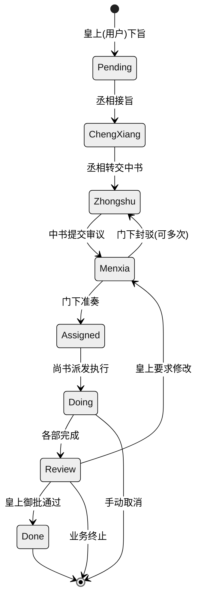

# 需求文档

这个一个全新的基于多 Agent 协作架构的个人助理项目，采用中国古代沿用千年的【三省六部】制度组织各个Agent进行工作，实现制度化的AI多Agent框架。
【三省六部】架构图见图片:

!\[image]\(\`D:\Code\Java\TangDynasty\image.png\` )

最高层的【皇帝】即为用户。

## 架构设计

### 业务架构

整个系统的流转模式如下：

```txt
              皇上
              (User)
               │
               ↓
             丞相 (ChengXiang)
        [分拣官、消息接入总负责]
      ├─ 识别：这是旨意还是闲聊？
      ├─ 执行：直接回复闲聊 || 建立任务→转中书
      └─ 权限：只能调用 中书省
               │
               ↓
           中书省 (Zhongshu)
      [规划官、方案起草总负责]
      ├─ 接旨后分析需求
      ├─ 拆解为子任务（todos）
      ├─ 调用门下省审议 OR 尚书省咨询
      └─ 权限：只能调用 门下 + 尚书
               │
               ↓
           门下省 (Menxia)
        [审议官、质量把握人]
      ├─ 审查中书方案（可行性、完整性、风险）
      ├─ 准奏 OR 封驳（含修改建议）
      ├─ 若封驳 → 返回中书修改 → 重新审议（最多3轮）
      └─ 权限：只能调用 尚书 + 回调中书
               │
         (✅ 准奏)
               │
               ↓
           尚书省 (Shangshu)
        [派发官、执行总指挥]
      ├─ 接到准奏方案
      ├─ 分析派发给哪个部门
      ├─ 调用六部（礼/户/兵/刑/工/吏）执行
      ├─ 监控各部进度 → 汇总结果
      └─ 权限：只能调用 六部（不能越权调中书）
               │
               ├─ 礼部 (Libu)      - 文档编制官
               ├─ 户部 (Hubu)      - 数据分析官
               ├─ 兵部 (Bingbu)    - 代码实现官
               ├─ 刑部 (Xingbu)    - 测试审查官
               ├─ 工部 (Gongbu)    - 基础设施官
               └─ 吏部 (Libu_hr)   - 人力资源官
               │
         (各部并行执行)
               ↓
           尚书省·汇总
      ├─ 收集六部结果
      ├─ 状态转为 Review
      ├─ 回调中书省转报皇上
               │
               ↓
           中书省·回奏
      ├─ 汇总现象、结论、建议
      ├─ 状态转为 Done
      └─ 回复飞书消息给皇上
```

业务流转示意图如下：



### 任务规格书

单次任务描述的字段说明如下：

```json
{
  "id": "JJC-20260228-E2E",
  // 任务全局唯一ID (JJC-日期-序号)
  "title": "为三省六部编写完整自动化测试方案",
  "official": "中书令",
  // 负责官职
  "org": "中书省",
  // 当前负责部门
  "state": "Assigned",
  // 当前状态（见 _STATE_FLOW）

  // ──── 质量与约束 ────
  "priority": "normal",
  // 优先级：critical/high/normal/low
  "block": "无",
  // 当前阻滞原因（如"等待工部反馈"）
  "reviewRound": 2,
  // 门下审议第几轮
  "_prev_state": "Menxia",
  // 若被 stop，记录之前状态用于 resume

  // ──── 业务产出 ────
  "output": "",
  // 最终任务成果（URL/文件路径/总结）
  "ac": "",
  // Acceptance Criteria（验收标准）
  "priority": "normal",
  // ──── 流转记录 ────
  "flow_log": [
    {
      "at": "2026-02-28T10:00:00Z",
      "from": "皇上",
      "to": "丞相",
      "remark": "下旨：为三省六部编写完整自动化测试方案"
    },
    {
      "at": "2026-02-28T10:30:00Z",
      "from": "丞相",
      "to": "中书省",
      "remark": "分拣→传旨"
    },
    {
      "at": "2026-02-28T15:00:00Z",
      "from": "中书省",
      "to": "门下省",
      "remark": "规划方案提交审议"
    },
    {
      "at": "2026-03-01T09:00:00Z",
      "from": "门下省",
      "to": "中书省",
      "remark": "🚫 封驳：需补充性能测试"
    },
    {
      "at": "2026-03-01T15:00:00Z",
      "from": "中书省",
      "to": "门下省",
      "remark": "修订方案（第2轮审议）"
    },
    {
      "at": "2026-03-01T20:00:00Z",
      "from": "门下省",
      "to": "尚书省",
      "remark": "✅ 准奏通过（第2轮，5条建议已采纳）"
    }
  ],
  // ──── Agent 实时汇报 ────
  "progress_log": [
    {
      "at": "2026-02-28T10:35:00Z",
      "agent": "zhongshu",
      // 汇报agent
      "agentLabel": "中书省",
      "text": "已接旨。分析测试需求，拟定三层测试方案...",
      "state": "Zhongshu",
      // 汇报时的状态快照
      "org": "中书省",
      "tokens": 4500,
      // 资源消耗
      "cost": 0.0045,
      "elapsed": 120,
      "todos": [
        // 待办任务快照
        {
          "id": "1",
          "title": "需求分析",
          "status": "completed"
        },
        {
          "id": "2",
          "title": "方案设计",
          "status": "in-progress"
        },
        {
          "id": "3",
          "title": "await审议",
          "status": "not-started"
        }
      ]
    }
    // ... 更多 progress_log 条目 ...
  ],
  // ──── 调度元数据 ────
  "_scheduler": {
    "enabled": true,
    "stallThresholdSec": 180,
    // 停滞超过180秒自动升级
    "maxRetry": 1,
    // 自动重试最多1次
    "retryCount": 0,
    "escalationLevel": 0,
    // 0=无升级 1=门下协调 2=尚书协调
    "lastProgressAt": "2026-03-01T20:00:00Z",
    "stallSince": null,
    // 何时开始停滞
    "lastDispatchStatus": "success",
    // queued|success|failed|timeout|error
    "snapshot": {
      "state": "Assigned",
      "org": "尚书省",
      "note": "review-before-approve"
    }
  },
  // ──── 生命周期 ────
  "archived": false,
  // 是否归档
  "now": "门下省准奏，移交尚书省派发",
  // 当前实时状态描述
  "updatedAt": "2026-03-01T20:00:00Z"
}
```

## 前端

### 总述

前端项目代码位于路径 `D:\Code\Java\TangDynasty\website` 下，需采用 React + TypeScript + Vite 构建，

页面实现效果需要和 `http://127.0.0.1:8088/chat` 完全保持一致，如图`D:\Code\Java\TangDynasty\example-website.png`
，示例网站的分层菜单描述如下：

| 分类     | 菜单      | 功能                                                                    |
| ------ | ------- | --------------------------------------------------------------------- |
| 聊天     | 聊天      | 这是和 AI 助手对话的地方。打开控制台后默认就是这个页面。                                        |
| 控制     | 频道      | 在这里管理各消息频道（钉钉、飞书、Discord、QQ、iMessage、Console）的开关和凭据。                  |
| <br /> | 会话      | 查看、筛选和清理所有频道的聊天会话。                                                    |
| <br /> | 定时任务    | 创建和管理 AI 助手按时间自动执行的定时任务。                                              |
| <br /> | 心跳      | <br />                                                                |
| 智能体    | 工作区     | 编辑定义 AI 助手人设和行为的文件——SOUL.md、AGENTS.md、 HEARTBEAT.md 等——全部在浏览器中完成。     |
| <br /> | 技能      | 管理扩展 AI 助手能力的技能（如读取 PDF、创建 Word 文档、获取新闻等）。                            |
| <br /> | 工具      | 管理 AI 助手使用的系统工具（如 执行命令行、进行浏览器Web搜索等 等）。                               |
| <br /> | MCP     | 启用/禁用/删除MCP，或者创建新的客户端。                                                |
| <br /> | 运行配置    | 修改最大迭代次数和最大输入长度，修改后点击保存。                                              |
| 设置     | 模型      | 配置 LLM 提供商并选择 AI 助手使用的模型。AI 助手同时支持云提供商（需要 API Key）和本地提供商（无需 API Key）。 |
| <br /> | 环境变量    | 管理 AI 助手的工具和技能在运行时需要的环境变量（如 TAVILY\_API\_KEY）。                        |
| <br /> | 安全      | 负责安全相关的配置，如 访问控制、工具权限管理 等。                                            |
| <br /> | Token消耗 | 查看一段时间内的 LLM Token 消耗，按日期和模型统计。                                       |

> 详细文档可参考 <https://copaw.agentscope.io/docs/>

本项目的分层菜单描述如下，必须严格实现：

| 分类     | 菜单   | 功能                                                                            |
| ------ | ---- | ----------------------------------------------------------------------------- |
| 早朝     | 上朝   | 这是和 AI 助手对话的地方。打开控制台后默认就是这个页面。对应参考中的聊天                                        |
| <br /> | 旨意库  | 预设圣旨模板 ，分类筛选 · 参数表单 · 预估时间和费用，预览旨意 → 一键下旨                                     |
| 御书房    | 频道   | 在这里管理各消息频道（钉钉、飞书、Discord、QQ、iMessage、Console）的开关和凭据。                          |
| <br /> | 旨意看板 | 查看、筛选和清理所有频道的聊天会话,若对应的会话Id是旨意（即一个需要Agent协作完成的任务），可点击弹窗查看进度 ，支持叫停 / 取消 / 恢复操作  |
| <br /> | 奏折   | 管理任务完成后，形成的结果，需要交由用户（皇上）审阅 ，一键复制为 Markdown                                    |
| <br /> | 定时任务 | 创建和管理 AI 助手按时间自动执行的定时任务。                                                      |
| 御史台    | 朝纲   | 编辑定义 AI 助手人设和行为的文件——SOUL.md、AGENTS.md、 HEARTBEAT.md 等——全部在浏览器中完成。             |
| <br /> | 技能库  | 管理扩展 AI 助手能力的技能（如读取 PDF、创建 Word 文档、获取新闻等）。                                    |
| <br /> | 工具库  | 管理 AI 助手使用的系统工具（如 执行命令行、进行浏览器Web搜索等 等）。                                       |
| <br /> | MCP  | 启用/禁用/删除MCP，或者创建新的客户端。                                                        |
| <br /> | 官员管理 | 配置三省六部各个部门官员的权限、模型、系统提示词Soul、输出限制等，同时支持为各部录用新的官员，初始的三省六部官员为系统默认官员，为各部门对应的最高职权 |
| 大理寺    | 模型   | 配置 LLM 提供商并选择 AI 助手使用的模型。AI 助手同时支持云提供商（需要 API Key）和本地提供商（无需 API Key）。         |
| <br /> | 环境变量 | 管理 AI 助手的工具和技能在运行时需要的环境变量（如 TAVILY\_API\_KEY）。                                |
| <br /> | 御林军  | 负责安全相关的配置，如 访问控制、工具权限管理 等。                                                    |
| <br /> | 大司农  | 查看一段时间内的 LLM Token 消耗，按日期和模型统计。                                               |

### 前端组件要求

- 相关功能实现使用Ant Design组件库，若仅用 AntDesign 无法实现，可自行搜索更多组件库，禁止使用原生的 HTML+css 实现。
- 与 AI Chat 相关的组件可考虑使用 Ant Design X，详情请查看 [Ant Design X](https://x.ant.design/components/introduce-cn/)

## 后端

后端服务基于Spring Boot实现，位于 Module `D:\Code\Java\TangDynasty\tang-dynasty-backend`，启动由launcher `D:\Code\Java\TangDynasty\tang-dynasty-launcher` 统一启动

### 架构说明

```txt
module/src/package/
├── adapter/                          # 适配器层：负责外部请求的接入与协议转换
│   └── controller/                   # 控制器层：接收 HTTP 请求，调用 Service 层，返回响应
├── common/                           # 公共模块：存放项目中通用的工具、配置和常量
│   ├── enums/                        # 枚举类目录：按业务分包存放各类枚举（如状态码、类型等）
│   ├── constants/                    # 常量类目录：按功能分包存放全局常量值（如系统标识、默认值等）
│   └── config/                       # 配置类目录：集中管理 Spring Boot 相关配置
│       ├── aimodelconfig/            # AI 模型相关配置
│       │   ├── properties/           # 利用 @ConfigurationProperties 读取 application.yaml 中的 AI 模型参数
│       │   └── modelclientconfig/    # 基于 properties 创建 Spring AI 的 Model 和 Client Bean
│       ├── mybatisconfig/            # MyBatis-Plus 配置：如分页插件、SQL 日志、类型处理器等
│       └── redisconfig/              # Redis 客户端配置：连接池、序列化方式、自定义 RedisTemplate 等
├── service/                          # 业务逻辑层：封装核心业务规则，Service以
│   ├── dto/                          # Data Transfer Object：用于服务间或层间数据传输的模型
│   ├── vo/                           # View Object：封装返回给前端的数据结构，避免暴露内部字段
│   └── impl/                         # Service 接口的具体实现类目录
├── utils/                            # 工具类模块：提供通用辅助功能
│   └── prompt/                       # Prompt 资源管理：加载并处理存放在 resources/prompt/ 下的提示词模板
└── infrastructure/                   # 基础设施层：提供技术支撑能力，解耦业务与底层实现
    ├── datasource/                   # 数据访问基础设施
    │   ├── po/                       # Persistent Object：与数据库表一一对应的实体类（通常由 MyBatis Plus 使用）
    │   ├── mapper/                   # MyBatis Mapper 接口：定义数据库操作方法
    │   └── support/                  # 数据库相关辅助接口，继承mybatis plus的IService接口
    │   	└── impl/ 				  # Support接口的实现类，继承mybatis plus的ServiceImpl，mapper层和po层集成到这里
    └── agentsupport/                 # AI Agent 基础设施支持
        ├── context/                  # 上下文管理：维护 Agent 执行过程中的会话、状态、记忆等
        ├── tools/                    # 自定义 Tool 实现：供 Agent 调用的函数工具（如查询数据库、调用 API）
        └── mcp/                      # Model Context Protocol 相关实现（待定）：可能用于多模型协作或上下文协议 
```


## 数据库设计

| datasource | table/document name  | description          | columns       | Type              | comment                           | 索引        |
| :--------- | -------------------- | -------------------- | ------------- | ----------------- | --------------------------------- | ----------- |
| MySQL      | td_task              | 任务/旨意表 (Tasks)  | id            | string            | 任务ID (如 JJC-20260228-E2E)      | PRIMARY KEY |
|            |                      |                      | title         | String            | 任务标题                          |             |
|            |                      |                      | official_id   | bigint            | 当前负责官员ID                    |             |
|            |                      |                      | dept_id       | bigint            | 当前负责部门ID                    | KEY         |
|            |                      |                      | state         | String            | 当前状态                          | KEY         |
|            |                      |                      | priority      | String            | 优先级: critical/high/normal/low' |             |
|            |                      |                      | block_reason  | String            | 阻滞原因                          |             |
|            |                      |                      | review_round  | int               | 审议轮数                          |             |
|            |                      |                      | prev_state    | String            | 被中断前的状态                    |             |
|            |                      |                      | output_result | Text              | 最终产出结果                      |             |
|            |                      |                      | ac_criteria   | Text              | 验收标准                          |             |
|            |                      |                      | archived      | TinyInt           | 是否归档                          |             |
|            |                      |                      | archived_at   | datetime          | 归档时间                          |             |
|            |                      |                      | deleted       | TinyInt           | 逻辑删除                          |             |
|            |                      |                      | version       | long              | 乐观锁版本                        |             |
|            |                      |                      | create_time   | datetime          | 创建时间                          | KEY         |
|            |                      |                      | update_time   | datetime          | 更新时间                          |             |
|            |                      |                      |               |                   |                                   |             |
|            |                      |                      |               |                   |                                   |             |
|            |                      |                      |               |                   |                                   |             |
|            |                      |                      |               |                   |                                   |             |
|            |                      |                      |               |                   |                                   |             |
|            |                      |                      |               |                   |                                   |             |
|            |                      |                      |               |                   |                                   |             |
|            |                      |                      |               |                   |                                   |             |
|            |                      |                      |               |                   |                                   |             |
|            |                      |                      |               |                   |                                   |             |
|            |                      |                      |               |                   |                                   |             |
|            |                      |                      |               |                   |                                   |             |
|            |                      |                      |               |                   |                                   |             |
|            |                      |                      |               |                   |                                   |             |
| MongoDB    | conversations_view   | Agent对话session视图 | id            | String            | 对话唯一标识id                    |             |
|            |                      |                      | userId        | String            | 用户id                            |             |
|            |                      |                      | title         | String            | 对话title                         |             |
|            |                      |                      | lastMessageAt | java.time.Instant | 最后一条消息的时间                |             |
|            |                      |                      | updatedAt     | java.time.Instant | 更新时间                          |             |
|            |                      |                      | createdAt     | java.time.Instant | 创建时间                          |             |
|            |                      |                      | unreadCount   | long              | 未读消息数量                      |             |
|            |                      |                      | messageCount  | long              | 消息总述                          |             |
|            |                      |                      | version       | long              | 版本                              |             |
|            | conversations_memory | Agent历史对话记忆    | id            | String            | 对话唯一标识id                    |             |
|            |                      |                      | userId        | String            | 用户id                            |             |
|            |                      |                      | messages      | List\<Object>     | 所有对话内容                      |             |
|            |                      |                      | roundCount    | long              | 对话轮数                          |             |
|            |                      |                      | updatedAt     | java.time.Instant | 更新时间                          |             |
|            |                      |                      | createdAt     | java.time.Instant | 创建时间                          |             |
|            |                      |                      | version       | long              | 版本                              |             |


### 重要要求

- 所有与数据库CRUD相关的逻辑均放到 `infrastructure.datasource.support` 包下，参考 `D:\Code\Java\auto-ai-movie\ai-movie-scripts\src\main\java\com\liangshou\movie\scripts\infrastructure\datasource\support`，确保数据访问逻辑与业务逻辑分离，不得在service层与Controller层中进行数据库操作。
- 确保数据库以及service职责单一，禁止将数据库操作逻辑与业务逻辑混在一起，禁止业务逻辑混杂；
- 严格按照分层架构、模块化、单一职责原则进行编码，禁止将多个功能逻辑混在一起，禁止业务逻辑混杂。

