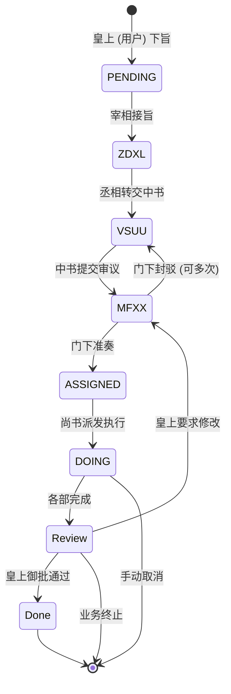

# 唐朝三省六部制多 Agent 协作系统

基于 AgentScope Java 实现的唐朝三省六部制多 Agent 协作系统，采用 Handoffs 模式实现完整的业务流转。

## 📋 目录

- [架构设计](#架构设计)
- [Agent 角色](#agent-角色)
- [工作流程](#工作流程)
- [快速开始](#快速开始)
- [API 接口](#api-接口)
- [使用示例](#使用示例)

## 🏛️ 架构设计

### 核心组件

```
┌─────────────────────────────────────────────────────────────┐
│              唐朝三省六部制多 Agent 系统                        │
├─────────────────────────────────────────────────────────────┤
│                                                              │
│  ┌──────────────┐  ┌──────────────┐  ┌──────────────┐       │
│  │   ZDXL       │  │    VSUU      │  │    MFXX      │       │
│  │  中书省       │  │   门下省      │  │  审议环节     │       │
│  │ 草拟诏令     │  │ 审议封驳     │  │ 详细审议     │       │
│  └──────────────┘  └──────────────┘  └──────────────┘       │
│           │                │                │                │
│           └────────────────┴────────────────┘                │
│                            │                                 │
│                     ┌──────▼──────┐                          │
│                     │    UHUU     │                          │
│                     │   尚书省     │                          │
│                     │  执行诏令    │                          │
│                     └─────────────┘                          │
│                                                              │
│  ┌──────────────────────────────────────────────────────┐   │
│  │        TangDynastyHandoffRouter (状态路由)            │   │
│  └──────────────────────────────────────────────────────┘   │
│                                                              │
│  ┌──────────────────────────────────────────────────────┐   │
│  │         StateGraph (状态图 - Handoffs 模式)            │   │
│  └──────────────────────────────────────────────────────┘   │
└─────────────────────────────────────────────────────────────┘
```

## 👥 Agent 角色

### 1. ZDXL - 中书省 Agent

**职责：** 草拟诏令（圣旨）

- 接收皇上（用户）的旨意
- 理解旨意的核心内容和意图
- 草拟正式的诏令文书
- 转交门下省审议

**Handoff 工具：**

- `transfer_to_vsuu`: 将草拟好的诏令转交门下省审议

### 2. VSUU - 门下省 Agent

**职责：** 审议封驳

- 审核中书省草拟的诏令
- 检查诏令的合法性、可行性
- 如有问题，行使封驳权（最多 3 次）
- 如无异议，准奏并转交尚书省

**Handoff 工具：**

- `transfer_back_to_zdxl`: 封驳返回中书省重拟
- `transfer_to_mfxx`: 提交详细审议
- `transfer_to_uhuu`: 准奏转交尚书省

### 3. MFXX - 审议环节 Agent

**职责：** 详细审议

- 从多个维度详细分析诏令
- 生成详细的审议报告
- 向门下省提供专业意见

**Handoff 工具：**

- `transfer_to_vsuu`: 完成审议，返回门下省

### 4. UHUU - 尚书省 Agent

**职责：** 执行诏令

- 制定执行计划
- 派发六部执行具体事务
- 监督执行进度
- 执行完成后提交皇上御批

**Handoff 工具：**

- `submit_for_review`: 执行完成，提交皇上御批

## 🔄 工作流程

### 业务流转图



### 状态说明

| 状态       | 说明               | 负责 Agent |
|----------|------------------|----------|
| PENDING  | 待处理（皇上刚下旨）       | ZDXL     |
| ASSIGNED | 已分配（门下省准奏后）      | VSUU     |
| DOING    | 执行中（尚书省派发各部）     | UHUU     |
| REVIEW   | 待 review（等待皇上御批） | UHUU     |
| DONE     | 已完成（皇上御批通过）      | -        |

## 🚀 快速开始

### 1. 环境要求

- JDK 17+
- Maven 3.6+
- DashScope API Key（阿里云百炼）

### 2. 配置环境变量

```bash
export DASHSCOPE_API_KEY="your-api-key-here"
```

### 3. 启动服务

```bash
cd tang-dynasty-agent-engine
mvn clean install
mvn spring-boot:run
```

### 4. 初始化系统

```bash
curl -X POST http://localhost:8080/api/tang-dynasty/init
```

## 🌐 API 接口

### 初始化系统

```http
POST /api/tang-dynasty/init
Content-Type: application/json
```

**响应示例：**

```json
{
  "success": true,
  "message": "唐朝三省六部制多 Agent 系统已启动",
  "agents": [
    "中书省 (ZDXL) - 草拟诏令",
    "门下省 (VSUU) - 审议封驳",
    "审议环节 (MFXX) - 详细审议",
    "尚书省 (UHUU) - 执行诏令"
  ]
}
```

### 流式聊天

```http
POST /api/tang-dynasty/chat/stream
Content-Type: application/json
Accept: text/event-stream

{
  "messages": [
    {
      "role": "user",
      "content": "朕欲在长安城修建一座新的宫殿，爱卿们速速拟旨"
    }
  ],
  "session_id": "session_001",
  "user_id": "user_001"
}
```

**流式响应示例：**

```
data: {"type":"ReasoningChunkEvent","data":"思考中...","timestamp":1234567890}

data: {"type":"ActingChunkEvent","data":"奉天承运皇帝，诏曰：...","timestamp":1234567891}

data: {"type":"ToolCallEvent","data":"transfer_to_vsuu","timestamp":1234567892}
```

### 获取系统状态

```http
GET /api/tang-dynasty/status?session_id=session_001&user_id=user_001
```

**响应示例：**

```json
{
  "healthy": true,
  "started": true,
  "agents": [
    {
      "name": "中书省",
      "id": "zdxl_agent",
      "healthy": true,
      "description": "中书省 - 负责草拟诏令，接收皇上旨意并起草正式文书"
    },
    ...
  ],
  "task_id": "task_1234567890",
  "task_status": "PENDING",
  "active_agent": "zdxl_agent",
  "review_count": 0
}
```

## 💡 使用示例

### 示例 1：标准流程

```bash
# 1. 初始化系统
curl -X POST http://localhost:8080/api/tang-dynasty/init

# 2. 发送旨意（皇上要修建宫殿）
curl -X POST http://localhost:8080/api/tang-dynasty/chat/stream \
  -H "Content-Type: application/json" \
  -H "Accept: text/event-stream" \
  -d '{
    "messages": [{"role": "user", "content": "朕欲在长安城修建一座新的宫殿，爱卿们速速拟旨"}],
    "session_id": "session_001"
  }'

# 3. 查看当前状态
curl http://localhost:8080/api/tang-dynasty/status?session_id=session_001
```

### 示例 2：封驳流程

```bash
# 如果门下省认为诏令有问题，会封驳返回中书省
# 系统会自动记录封驳次数，最多 3 次

# 继续对话，门下省可能会说：
curl -X POST http://localhost:8080/api/tang-dynasty/chat/stream \
  -H "Content-Type: application/json" \
  -H "Accept: text/event-stream" \
  -d '{
    "messages": [{"role": "user", "content": "准奏"}],
    "session_id": "session_001"
  }'
```

## 🔧 技术特性

### 1. 流式输出

基于 AgentScope Java 的 `Flux<Event>` 实现真正的流式输出：

- 实时显示推理过程（ReasoningChunkEvent）
- 实时显示工具执行（ActingChunkEvent）
- 支持增量输出（incremental=true）

### 2. Handoffs 交互

通过 Tool + State 实现智能交接：

- 每个 Agent 注册自己的 Handoff 工具
- 工具调用时更新 `active_agent` 状态
- 状态图根据 `active_agent` 路由到下一个 Agent

### 3. 状态持久化

集成 StateService 实现状态保存和恢复：

- 每次对话后自动保存状态
- 支持中断后恢复
- 跨会话保持上下文

### 4. 审议次数限制

门下省的封驳次数限制为 3 次：

- 自动记录审议次数
- 达到上限后强制准奏
- 防止无限循环

## 📝 代码结构

```
src/main/java/com/liangshou/tangdynasty/agentic/agents/instance/
├── AgentInstanceFactory.java          # Agent 实例工厂接口
├── TangDynastyAgentConstants.java     # 常量定义
├── AbstractTangDynastyAgent.java      # 抽象基类
├── ZDXLAgent.java                     # 中书省 Agent
├── VSUUAgent.java                     # 门下省 Agent
├── MFXXAgent.java                     # 审议环节 Agent
├── UHUUAgent.java                     # 尚书省 Agent
├── TangDynastyHandoffRouter.java      # Handoffs 路由器
├── TangDynastyAgentFactory.java       # 多 Agent 工厂
└── TangDynastyAgentController.java    # REST 控制器
```

## 🎯 扩展开发

### 添加新的 Agent

1. 继承 `AbstractTangDynastyAgent`
2. 实现 `getName()`, `getDescription()`, `getSystemPrompt()`
3. 在 `registerHandoffTools()` 中注册交接工具

### 自定义路由策略

1. 创建新的 `EdgeAction` 实现
2. 在 `TangDynastyHandoffRouter` 中添加路由逻辑
3. 更新状态图的边定义

### 集成到其他系统

通过依赖注入使用 `TangDynastyAgentFactory`：

```java

@Autowired
private TangDynastyAgentFactory agentFactory;

// 启动系统
agentFactory.

start();

// 发送请求
var response = agentFactory.streamQuery(request, messages);
```

## 📚 参考资料

- [AgentScope Java 官方文档](https://java.agentscope.io/zh/intro.html)
- [Handoffs 模式文档](https://java.agentscope.io/zh/multi-agent/handoffs.html)
- [Project Reactor 文档](https://projectreactor.io/docs/core/release/reference/)

## 🤝 贡献指南

欢迎提交 Issue 和 Pull Request！

## 📄 许可证

Apache License 2.0
